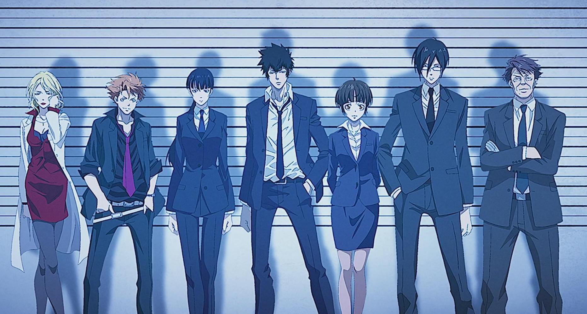

2012 年的动漫，由于国内封杀，其由 EGOIST 演唱的 ED《名前のない怪物》比作品本身流传更广。由虚渊玄加盟的第一部比第二部优秀。作品描述了一个由测定的指数决定人的生活、犯罪的定夺甚至生死的世界，可是测定心理指数的系统本身又是如何构成呢？它的合法性从何而来？如果出现了它不能判定的人，应该怎么办？它会不会犯错？

这当然是对现实非常好的映射。虽然我们并没有一个决定一切的判定系统，但我们确实有很多决定了不少事情的判定系统。这些系统是谁设计的？合理性来源于哪里？它们真的能判定一切人吗？也可以用系统类比道德和法律。会不会有超出道德体系判定的人？一切罪行应该经由道德判定和定罪吗？

最终的真相是，这个系统，先知系统本身就是由系统无法判定的人的大脑构成的，并且无问善恶。它就像是在以人群为素材进化。这部作品并没有将先知系统作为反派大 BOSS，主角常守朱知悉其真实面目后仍然认可了系统的必要性，并继续与系统亦敌亦友的合作，作为警察维护她心中的正义。

仅就前两季而言，有一些我不太舒服的点。一是，作品中超出先知系统的人，主要是特殊体质，而并不是能力或者思想。这些人只是一些「特例」而已。并且两部作品中他们都是罪犯，犯下滔天罪行后被杀死。所以虽然这部作品总是在先知系统的阴影下，但却是承认先知系统的，有一种革命，反抗，但又革命不彻底的感觉。二是，过于纠结于设定，丢失了与现实世界的联系。特别是第二部，像是在纠结一些哲学问题，但与现实世界的映射关系就非常弱了。并且第二部的先知系统、人物都有些过于执着自己的信念。常守朱总是说要受到法律、正义的制裁，可是这个世界里压根没有法律，直到最后也没有恢复法律。这个问题处理不好的一个例子是，常守朱在第二部放跑罪犯，从这里看她的正义不过是杀人必须经由先知系统认可，用支配者开枪。

作为原创作品，两部之间的不协调可以理解。有时间再看一下第三部和系列剧场版。