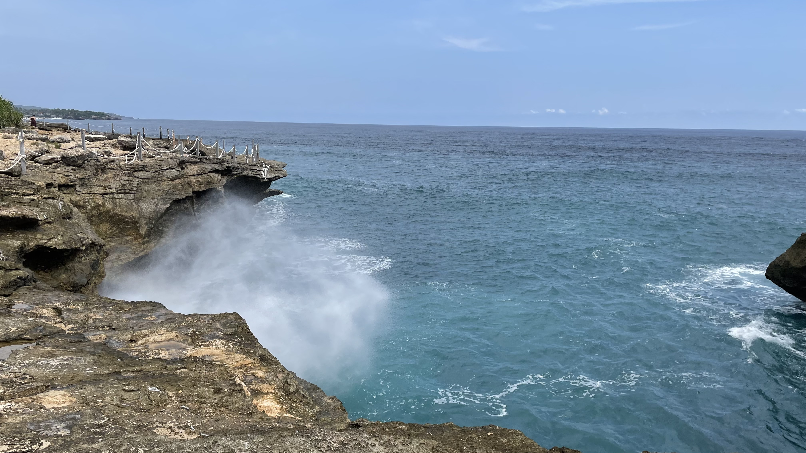

已经很久没有更新这个博客了，上个月跟旧友去了巴厘岛，结束之后，整理在这里吧。

----

在新加坡闷了一年，终于在五月中旬抽出时间去巴厘岛游玩。巴厘岛物价便宜，与新加坡距离不远，有美丽的海滩风景。行程六天，实际游玩的时间只有四天，很遗憾因为天气没有看到日出日落，有机会再飞一次。

### 行前准备

2022-05-18 起巴厘岛不再需要行前核酸检测，出行前的准备大大简化，主要是换汇、手机卡、打印疫苗接种证名和行程单。

【证件】

巴厘岛机场对中国大陆护照可以办理落地签，落地签花费大约 80 新币，需要印尼盾现金支付。从新加坡出发，带好【护照、新加坡 EP 卡、中国身份证】。同时准备好【回程机票（行程单）的纸质版】。

【检疫手续】

从 2022-05-18 起，入境巴厘岛不再需要行前核酸检测，但要准备好【疫苗接种证书】。新加坡可以从 Tracetogether 下载 PDF 格式的疫苗接种证书，打印后携带纸质版。

巴厘岛最新防疫政策，

[https://www.indonesia.travel/sg/zh-cn/news/latest-travel-regulations-to-enter-bali](https://www.indonesia.travel/sg/zh-cn/news/latest-travel-regulations-to-enter-bali)

【换汇】

巴厘岛的餐饮、购物较为便宜，酒店和比较好的餐馆以及便利店可以使用 VISA 卡。在尽量使用 VISA 卡前提下，每星期每人可以换汇 200 新币左右，行前每人至少换汇 200 新币随身携带。新币对印尼盾汇率约 1:10000，新加坡可以直接预约樟宜机场换汇，

[https://fx.changirecommends.com/exchange](https://fx.changirecommends.com/exchange)

【手机卡】

我使用了中国移动国际漫游，比较便宜，但似乎有墙。。不推荐。。

【防蚊】

当地蚊子猖獗，带点防蚊贴花露水清凉油之类的东西。

### 食宿出行

可能因为当地旅游业发达，初到巴厘岛，一个鲜明的感受是当地人特别热情好客，即使没有买卖或者没有付小费，他们也会热情的打招呼致意。很多当地人会说一点英语，少部分人会说一点汉语，语言不是问题。巴厘岛有付小费的习惯，心情好可以付一两万印尼盾小费，相当于一两新币或者人民币五到十元。

【治安】

直观的感受是治安还可以，但我不想测试，建议晚上尽量不要出门，出门尽量使用 Grab 打车。有一个本地的司机也提到，Grab 打车比较安全，因为多少会有一些监控。

【出行】

巴厘岛基本没有公共交通，出门主要靠打车，一定要准备好打车软件，在新加坡注册的 Grab 无法在印尼使用扫码付款功能，但可以正常打车。

巴厘岛市区交通很差，打车 3～5 公里大约半个小时、 10 新币以下，10 公里大约一个半小时， 20 新币。远离市中心打车会稍快一点，同样里程也会稍便宜一点。

可能是我们出行时是淡季，Grab 在大部分区域能够很快打到车。

【住宿】

巴厘岛宾馆很便宜。我在巴厘岛的四个晚上住市区 element by westin bali ubud，每天在 60 新币以下，条件很好。市区去各个景点交通其实不太方便，但好处是方便觅食、不用每天搬家。最后一天为了看海滩日落，住在机场附近的一家五星酒店，会贵一些，其实条件不会比上一家好太多。

【饮食】

相对新加坡，巴厘岛的饮食很便宜，比较好的餐厅一餐 15 新币左右，想吃海鲜大餐上不封顶。有些大众点评热门餐厅甚至每餐 8 新币以下，而且味道很不错。如果行程安排紧凑，没时间吃饭，街边有很多类似 711 的连锁便利店可以买一些零食。连锁便利店可以刷 VISA 卡。

可以在大众点评、谷歌地图上找推荐的餐厅。个人而言不是很热衷美食，当地的食物没有特别惊艳的感觉，而且当地买到的椰子都特别嫩，不甜，非常失望，还不如新加坡超市里的椰子。

【购物】

简而言之，巴厘岛购物不怎么样，并没有多少非常有当地特色的东西。很多街边店是面向游客的，出价特别高，需要砍价，比较麻烦，而且当地的商品看上去还不如淘宝货，只适合买点纪念品。

基本上小纪念品价格大约 10 元新币以下，我买了一个小小的捕梦网，6 元新币，一个草帽，十元新币，草帽大概买贵了。

还有一个奇特的小笔记本，两元，它的奇特之处是纸张材质特别像加厚版的中国祭祀用火纸，我称呼它为死亡笔记，可以用来写上仇家的名字，然后撕下来烧掉。

## 蓝梦岛一日游

行程第一天，我们直接买了携程蓝梦岛一日游，主要活动是两次浮潜、蓝梦岛环岛游。去蓝梦岛需要乘船，小心晕船。如果从乌布出发，需要早起。

浮潜是我个人在这趟旅程最喜欢的活动，但前提是游泳技术好。我们的导游心比较大，乘船到恰当地点后，穿好救生衣和浮潜用的呼吸面具，我们就跳海里了，除了穿上的导游没有其他安全措施。我不习惯救生衣和浮潜面具，带着面具反而感觉要溺水，把装备扔回船上感觉好多了。但自然水域不是闹着玩的，没有经验千万不要脱救生衣。

可惜没有带水下摄像机，没有拍到海底的珊瑚和鱼群。想学自由潜水了。

环岛游可以欣赏一下巴厘岛清澈的海、美丽的海滩和壮丽的海边悬崖。

我们第二天的活动是漂流、秋千以及乌布的一些零散的景点。漂流和秋千推荐程度中等，有时间可以去玩。乌布市区景点不怎么样，有时间随便看看就好。我们还去了一些散落在岛上的小瀑布，虽然找这些小瀑布有一点意思，但交通不便，比较花时间。

巴厘岛有一种称为「善恶之门」的宗教建筑，值得一看，但到处都是，机场旁边就有一个，除了大小之外大同小异。

## 日出与海豚

我们第三天清晨乘「蜘蛛船」在巴厘岛北部海面海豚、看日出。我们运气不好，当天云层很厚没有看到海上日出。但船主和海豚非常给力，不仅能看到野生海豚成群结队跳出水面，而且在海面上追逐的过程也充满趣味。

跃出水面的海豚看上去非常欢乐，说不定他们也是想要跳出来围观两脚兽。

### 滑翔伞

行程第四天，我们尝试了从悬崖上起飞的滑翔伞，体验海面上「出舱」飞行！如果你的教练心情好，并且你足够胆大，还可以请求他做点飞行特技！

滑翔伞不虚此行，但滑翔伞基地位置有点偏，可以打到 Grab 车过去，但打不到回程的车。我们的去程司机非常有耐心的等我们完成，又把我们送回去了。一开始我们并不太信任他，但没想到回程真的打不到车。司机并没有多收钱，我们也很乐于给他一点小费。

最后一天傍晚，我们在沙滩等待落日，但天气再次不作美。没有落日的海滩仍然很美，于是更是期待下一次行程，期待能够看到海上日出与日落。

