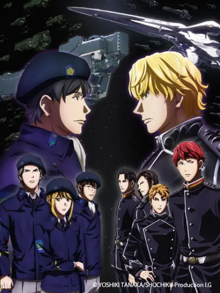

## 2022.07 激战

银英传是所谓的太空歌剧，跟科幻其实基本没什么关系。这是一个关于民主、专制、军事的故事，不凑巧的是日本动漫在这方面其实很幼稚，但更解释不通的是，如果能忍受这部动漫过于戏剧性的情节（此时默念，这是太空歌剧），那么这部动漫观感不错。

我也没有看过多少传统的帝王将相故事，就当这是一个传统的帝王将相故事吧。

## 2203.02 阴谋

翻新版的《全新命题》还在一章一章更新，现已更新到第四季《阴谋》。前三季分别是《邂逅》，《星乱》，《激战》。

有生之年系列，慢慢等待更新。
