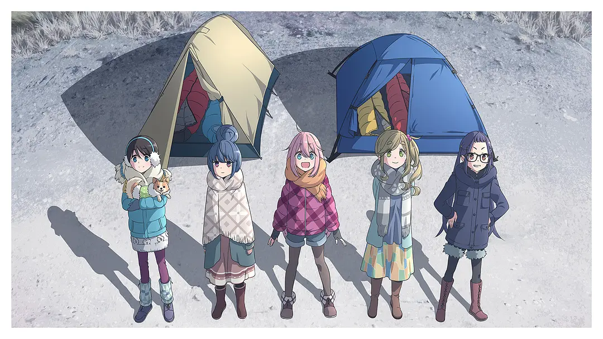
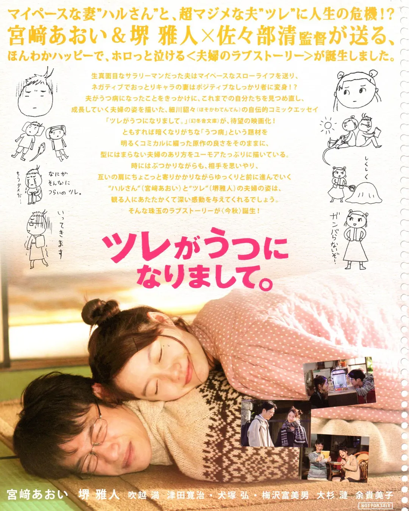

# 摇曳露营 第一季

我的某个朋友和关注的某个 UP 主评价很高的一部动漫。并没有特别惊艳，但确实有点冬日暖阳的味道。

露营一般是在夏季，但志摩凛却喜欢冬季露营，冬日暖阳下暂时远离尘世。

## 丈夫得了抑郁症

好像是在什么心理学朋友圈看到的电影标题，找来看了看。题材比较特殊，而且是真实故事改编。电影本身我的感觉是中规中矩。

堺雅人全局都挂着跟这张海报差不多的笑脸，他想死的时候也挂着这副笑脸。这意外的很符合我对抑郁自杀的日本人的刻板印象。全片并不讨论为什么会这样，只是平淡、温暖的讲述这个故事。

抑郁有时并不是这么平淡、温暖的故事。它是加害与受害，虚伪的道德与懦弱。。

## 夏日重现

剧情很赞，妹子赏心悦目。最喜欢的是龙之介老师，以及 OP1 ED1. 可惜后半部分的 OP2 ED2 感觉没有那么惊艳了。
