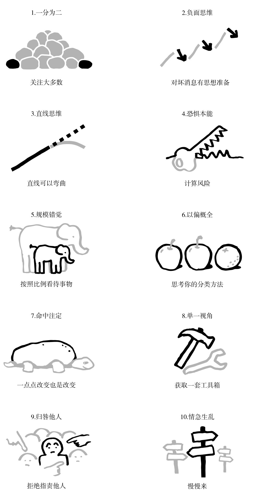

非常不错的一本书，讲了我们在认识社会，特别是诸如战争、经济发展之类的「大问题」时，常常存在的十种思维误区。本书的作者是一位致力于解决全球卫生、贫困等问题的专家，这些思维误区是他在工作、与各界人士交流过程中总结的，在人群中普遍存在。最为可贵的是，书中也给出来了切实可行的应对方法。

读过本书之后，会直白地感受到当今世界并没有那么糟糕，我们大可乐观一点，在这个信息过载的时代，不要被媒体耸人听闻的报道牵着鼻子走。

本书最后甚至给出了一幅图，总结了十种思维误区，并形象的给出了「实事求是」的解决方法。

- 一分为二，也即只看到人群中的两级，最富裕的人和最贫穷的人，解决办法：
  - 我们要注意只比较平均数的做法，还应该注意比较数据分布
  - 我们要注意只比较极端情况的做法
  - 我们要注意只俯视不仰视的做法
- 负面思维，人的本能总是更注重坏消息，解决办法：
  - 更好和不好。我们要区分状态和趋势，认识到事情同时可以是不好的，但也在变得更好
  - 好消息不是新闻，注意报道偏差
  - 循序渐进的进步不是新闻，注意报道偏差
  - 更多的坏消息并不意味着更多坏事
  - 警惕过分美化的历史，过去可能没有那么好
- 直线思维，也即总是认为事情会线性的发展
- 恐惧本能，当我们感到恐惧时，我们应该认识到我们恐惧的事情不一定是真正的危险
  - 媒体会刻意选择吓人的信息来吸引我们的注意力
  - 风险 = 危险程度 X 发生的可能性
  - 在采取行动之前，先让自己冷静下来
- 规模错觉，当看到一个令人印象深刻的数字是，一定要和其他数字进行比较
  - 二八原则，分清主次
- 以偏概全，当我们讨论一个群体时，要控制我们以偏概全的本能
  - 在同一类别中找不同
  - 在不同类别中找相同
  - 注意大多数，我们应该具体区分，大多数究竟是 51% 还是 99%
  - 注意极端案例，极端案例通常不是普遍现象
  - 不要假设别人时傻瓜
- 命中注定，很多事情看似保持不变，仅仅是因为变化发生的很缓慢
  - 注意追踪持续的提高
  - 更新你的知识
  - 与老年人对话，感受价值观是如何变化的
  - 收集文化改变的案例
- 单一视角，手里拿着一把锤子时，看什么都像钉子
  - 必须有一个工具集合，而不能只有一把锤子
  - 检查你的想法，与不同意见的人讨论
  - 有限的经验，不要认为你在专业领域之外有什么真知灼见
  - 关注数字，但不仅仅关注数字
  - 当心简单的想法和简单的解决办法
- 归咎他人
  - 寻找原因，而不是寻找坏人
  - 寻找系统，而不是寻找英雄
- 情急生乱
  - 紧急情况下，深呼吸，保持冷静
  - 坚持了解基本数据
  - 警惕那些带有偏见的预言家
  - 小心过激的行动
