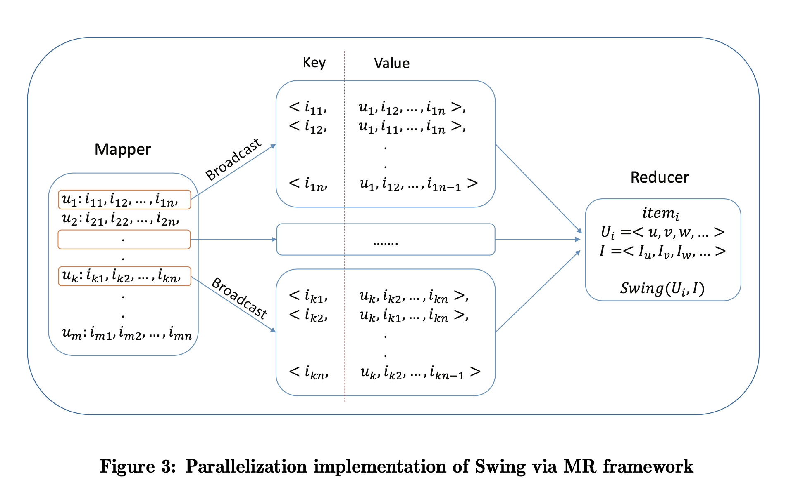

# Swing 算法在搜索召回中的应用

## Swing 算法

Swing 算法是阿里于 2020 年提出的一种物品间相似度计算方法。该方法类似于协同过滤（CF）算法，只依赖于用户行为数据，不依赖物品的文本特征等 content 信息。该算法的更多细节可以参照[阿里 Swing 论文](https://arxiv.org/pdf/2010.05525.pdf)。

Swing 算法的核心是物品 (item) 之间的相似度计算公式，

$$
S(i, j) =  \sum_{u \in U_i \bigcap U_j}\sum_{v \in U_i \bigcap U_j}
w_u \cdot w_v \cdot \frac 1 {\sqrt{1 + |I_u \bigcap I_v|}} \\
w_u = \frac 1 {\sqrt{|I_u|}} \, ,w_v = \frac 1 {\sqrt{|I_v|}}
$$

公式中，$i, j$ 是物品，$u, v$ 是用户，$u_i$ 是于物品 $i$ 有交互的用户集合，$I_u$ 是用户 $u$ 有交互的物品集合。

对于 CF 算法，考虑一对 item $i, j$, 只要有一个用户同时点击了这一 item pair 就可以计算相似度得分。但对于 Swing 算法，其相似得分计算基于 user pair, 需要至少有两个 user 同时点击了这两个 item 才可以计算相似度得分。

按照按照论文中的看法，单个用户的点击具有随机性，但两个以上用户都同时点击了某个 item pair, 则误点的可能性会较低。从而，Swing 能够得到比 CF 更高质量的相似度矩阵。

## 业务应用

阿里最初是将 Swing 算法用于推荐场景。CF 是推荐场景的经典算法，Swing 可以直接替代 CF 在推荐场景中的应用。对于某个用户，首先设法生成一个用户可能感兴趣的 item list, 通常是用户的点击历史，这些 item 称为 trigger, 之后利用预计算的 item 相似度矩阵，称为 I2I (item to item) 矩阵进行召回即可。这种召回方式称为 U2I2I 召回。

我们尝试将 I2I 召回方法应用在了搜索场景中。我们给出了两种应用场景。第一种是，直接套用推荐场景的 U2I2I 召回，但考虑到搜索场景对相关性的要求，对 trigger 或者召回之后的 item 基于 text match 进行过滤，过滤标准类似于召回的 item 至少能匹配搜索 query 的一个词。

如果户行为历史 trigger 能够做到实时更新，并且召回算法也具有良好的实时性，则该方法在用户的同一个 session 中会表现很好，特别是对于搜索场景，当用户连续下刷，或者搜索结果翻页时，对于位置靠后的物品会有非常好的效果。原理很显然，用户在同一个 session 甚至同一次搜索行为中，其之前点击的 item 能够最好的反应这个用户的意图。

另一种场景是，使用现有召回的高质量 item 作为 trigger, 扩增召回。这种方法特别适合于当召回不满时提高召回数量。这种方法的一个工程困难是，寻找高质量 item 通常需要在 pre-rank 或者 rank 阶段之后，在此之后进行扩张召回就意味着新召回的 item 需要重新过一遍 pre-rank, 延时会增加。或者 skip pre-rank, 则会有 bad case 风险。

我们为每个 item 生成了大约一百个相似 item, 因此少数几个 trigger 就能召回大量相似 item. 可以在相似 item 列表长度和 trigger 数量之间进行权衡。

## 实现细节

Swing 算法的公式看似简单，但在工业场景下将其实现并不容易。工业场景下会有百万以上 item, 因此不可能生成稠密的 I2I 矩阵，实际实现的算法是对每个 item 生成 similar item list.

工业实现数据 pipeline 第一步是生成 user-items list, 也即每个用户交互物品序列。「交互」可以是点击、观看、电商平台的下单等等。可以综合多天数据（如一周，一个月）生成交互物品序列。单个用户的交互物品数目可以限制在几百（如 500），多于限制可以随机采样。

### Swing Paper 实现方法

Swing Paper 中提供的基于 MapReduce 实现方法如下，



```python
# mapreduce streaming & python based pseudo code

# mapper
for user_item_list in inputs():
    user, items = user_item_list[0], user_item_list[1:]
    for i in items:
        key = i
        val = [user] + remove_from_list(items, i)
        print(key, " ", val)

# reducer
users = set()
items = set()
for record in records_of_the_same_key():
    key_item, user, others = record[0], record[1], record[2:]
    users.add(user)
    items.add(key_item)
    for it in others:
        items.add(it)
for score in calculate_swing(users, items):
    print(score)
```

其 Mapper 步骤，输入为 user-item_list, 对每一条 user-item_list, 对每个 item, 使用该 item 作为 key, 以 user 和其他 item 作为 value 生成一条新的 record. Mapper 的每条输入会生成多条输出，输出条数是输入 item list 长度。使用 item 作为 key 是为了令其 Reducer 可以汇总与某个 item 发生交互的所有 user, 并且 user 带有其本身的交互 item list, 于是可以按照公式计算 Swing score.

这个方法并不适合实际应用。其主要问题是，Mapper 会将输入数据扩增 N 倍，N 是 user's item list 长度，N 可以达到几百，数据量会非常大。Reducer 也需要将与某个 item 发生交互的所有用户信息汇总到单个节点上，对于 hot item 容易导致单个节点挂掉。所以，这个方法无法处理 TB 级别的数据集。

### 优化实现方法

对于一些 hot item, 与其有过交互的用户会非常多，甚至对于这些 hot item 构成的 item pair, 与其同时有过交互的用户集合也会非常大，也即 $U_i \bigcap U_j$ 是一个非常大的集合，直接按照公式计算，就需要枚举这个集合中两两用户 pair, 其数量会非常大，并不现实。在这里我们提出一个带采样的实现。

该实现基本思路是将 Swing 计算分解成了 I2U 和 U2I 两步骤，并分别进行采样。通常，正常用户不会有太多交互的 item, 所以 U2I 采样并不会丢弃太多数据。I2U 采样受算力限制也控制在几百到几千量级，这一步会丢弃较多数据。但最终生成的 I2U2I 数据结构能够提供 recalled_item_limit * user_limit 个「记分点」，通常也足够了。下面给出伪代码。

```python
# pyspark based peseudo code

# [user1, [item11, item12, ...]], [user2, [item21, item22, ...]]
input_df = inputs()
recalled_item_limit, user_limit = get_params()

@udf
def sample_udf(arr, N):
    return random.sample(arr, N) if len(arr) > N else arr

user_to_recalled_item_df = input_df.select(
    col("user"),
    sample_udf(
        col("items"),
        recalled_item_limit
    ).alias("recalled_items")
)

left_item_to_user_df = input_df.select(
    col("user"),
    explode("items").alias("trigger_item")
).groupBy(
    col("trigger_item")
).agg(
    sample_udf(
        collect_list(col("user")),
        user_limit
    ).alias("users")
)

i2i = left_item_to_user_df.select(
    col("trigger_item"),
    explode("users").alias("user")
).join(
    left_item_to_user_df,
    ["user"],
    "inner"
).select(
    col("trigger_item"),
    struct(
        col("user"),
        col("recalled_items")
    ).alias("user_to_recalled_items")
).groupBy(
    col("trigger_item")
).agg(
    collect_list(
        col("user_to_recalled_items")
    ).alias("users_to_recalled_item_lists")
).select(
    calculate_swing(
        col("trigger_item"),
        col("users_to_recalled_item_lists")
    ).alias("i2i_list")
)
```

也有人尝试了其他实现方法，这些方法各有优劣，但如果实现方法中进行了采样，需要注意，对 item 的 user list 进行采样会丢失较多数据，公式中的 $U_i, U_j$ 最多只有一个是经过采样的，要保证另一个不是独立采样生成的，否则 $U_i \bigcap U_j$ 交集大小会迅速减小，因为两个采样过程同时采到同一个 item 的概率是乘数关系，进而导致召回数目不足。本文给出的实现中，$U_i$ 是在生成 I2U 列表过程中进行了采样，但 $U_j$ 是在 U2I 列表隐含的，在只考虑是 $U_i$ 子集的前提下，是全量数据。

> 我们在早期阶段实现过一个有问题的版本。该实现的步骤是，
> 
> 1. 对 user 的行为历史 item_list 中的 item 两两交互形成 item_pairs
> 2. 将 user-item_pairs 表反转成 item_pair-users 表
> 3. 对 users 进行采样后，再将 users 两两交互形成 item_pair-user_pair 表
> 4. 关于 user_pair 进行 aggregate 得到 item_pairs, 之后就可以计算 Swing score
>
> 由于 Swing 算法需要计算 $I_u \bigcap I_v$ 所以该方法最后一步需要关于 user_pair 进行 aggregate，并另行计算公式中的 $w_i, w_j$.
> 
> 这个算法的问题在于，第 3 步中不同 item_pair 对应的 user_pair 是独立采样形成的，所以在第 4 步的 aggregate 过程中，item_pairs 必须同时采样到同一个 user_pair 才能被 aggregate 到一起，所以召回数量严重不足。

## Swing 算法的优劣

除了 Swing 之外，常见的 I2I 矩阵生成方法还包括 CF 算法或者基于深度模型的算法。基于深度模型的算法可以基于文本或者用户行为等特征训练生成 embedding, 然后基于 embedding 进行 KNN 召回。

Swing 不需要训练深度模型，通常实现为定时运行更新的 Spark Job, pipeline 比深度模型简单。但从头实现这个算法并不容易。

相比于 CF, Swing 算法生成的 I2I 列表质量更高。基于深度模型的方法效果通常也不如基于统计的方法。Swing 算法的 coverage 会差一些，是对于用户行为较少的长尾 item, 能够召回的相似 item 较少，甚至没有召回。如果想要提升召回数量，就需要更多数据或者提高采样率，但这会增大计算开销。Swing 由于召回列表不定长，其 False Positive 概率会比 KNN 方法低。
