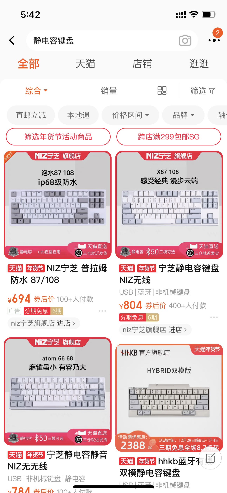
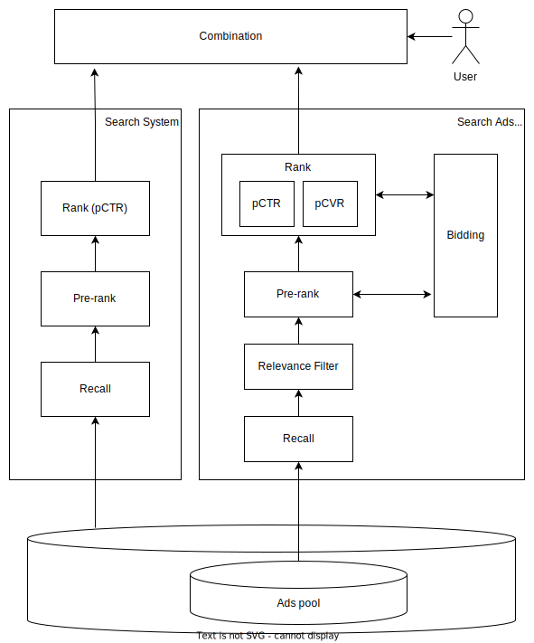

本系列文章将会介绍过去一年中，我所学习到的电商搜索广告相关的技术。首先，第一篇文章，讨论电商搜索广告问题的定位。

【搜索】，顾名思义，用户输入【关键词】，检索感兴趣的物品。不同于推荐场景，推荐场景中，用户并不输入关键词，因此全靠算法「猜测」用户兴趣。但搜索场景中，关键词能够极强的表达用户的兴趣，甚至不考虑用户之间的差异，只使用关键词进行搜索，很多场景下也足以取得足够好的效果。

【电商】是互联网最重要的应用场景之一，在美国孕育了亚马逊等等巨头，在中国孕育了阿里巴巴、京东、拼多多等等。电商平台上，商家会按照固定的格式整理好商品（商品标题文本、图片、价格），并将商品相关信息保存在电商平台上。不同于网页搜索，电商平台能够轻易获得商品的价格、历史销量、历史评价等等信息。用户一般乐于在电商平台上消费，近水楼台先得月，电商平台也相对容易获得收入。

【广告】是互联网最重要（可能没有之一）的变现方法，或者称为「商业化」方法。尽管有些人，比如我自己，很讨厌广告。电商平台虽然可以通过收取佣金获取利润，但也可以允许商家投放广告。【搜索广告】，即商家支付一定的广告费，其商品将会在搜索结果页得到优先展示，并标记「广告」或者 Sponser 等字样。

电商搜索广告对用户并不陌生，这里展示手机淘宝搜索广告的一例，注意第一个商品被标记为「广告」。广告商品跟正常搜索结果混排在一起，不仔细看甚至难以分辨。

电商搜索广告是所谓的「原生广告」，广告商品本身也是正常商品，广告与用户当前的搜索意图高度关联，因此对用户体验影响相对较小。还有一种更直接的做法是竞价排名，也即不再区分广告商品和正常搜索结果商品，广告费直接提升商品排名。但在中文互联网中，百度竞价排名事件使得竞价排名臭名昭著。

## 搜索广告技术

有人会说「推广搜」不分家，是指推荐、搜索、广告三个场景的技术是高度关联的。三者都是信息检索问题，一般都具有典型的「漏斗模型」。相对而言，广告独有的问题是竞价问题。

图示为搜索系统和搜索广告系统的示例。两者的相同之处是，都具备类似于「漏斗模型」。首先，所有的候选物品，构成了物品池 item pool. 对于电商平台而言，物品池就是所有的商品。搜索系统直接从所有的有效商品中进行检索。电商平台的广告商品一般是所有商品的一个子集，商家会选择一部分商品为其充值广告，这部分商品就构成了广告池。广告系统从广告池中进行检索。广告池一般比全部商品池要小很多，比如，平台商品有 100M, 但广告可能只有 10M.

漏斗模型的第一步一般是召回阶段 Recall, 该阶段借助倒排索引、向量化召回等技术，从整个物品池中快速召回关联的物品构成候选集。之后是预排序阶段 Pre-rank 和排序阶段 Rank. Pre-rank 几乎就是简化、快速版本的 Rank, 这里暂且略去不谈。Rank 阶段是对 Recall 所返回的候选物品进行进一步的精细化排序。对于搜索系统而言，其唯一目标就是返回高质量（高点击率、高相关）的商品，其排序模型最典型的就是点击率预测模型 pCTR. 但对于广告系统而言，问题比较复杂，广告系统需要平衡用户、平台、商家三方利益，典型的排序机制是 eCPM 排序，该机制需要考虑 pCTR, 也要考虑商家的广告出价，甚至其他更复杂的因素。为此，广告系统还需要包含转换率预测模型 pCVR 和出价系统 Bidding.

搜索系统和广告系统都完成排序生成结果后，最后一步是将两者的结果合并，向用户展示。最简单、最经典的合并方案就是固定广告位，也即搜索结果中固定一些位置放置广告结果，一些位置放置正常搜索结果。广告结果常常更靠前。存在更为复杂的混排机制，但因为算法和工程成本都很高，并不十分普及。固定广告位机制虽然可能不是最优的，但可以解耦搜索系统和广告系统，方便两个团队分别迭代。

接下来的一系列文章将会分别介绍搜索广告系统的各个模块。