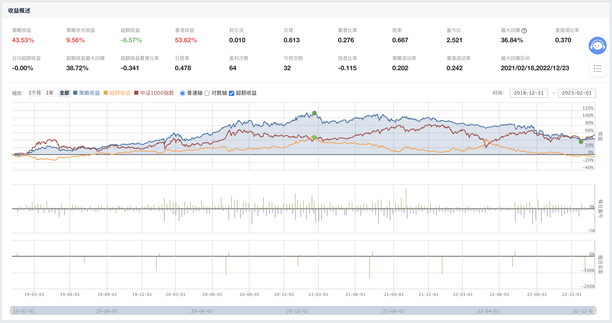

理财新手通常会投资主动基金。2019 年主动基金取得了非常突出的业绩，吸引了大量新手（韭菜）入场。然后之后不出意料的一泻千里，大量韭菜光荣套牢。我在跌了 20 个点的时候感觉差不多了入场，光荣的被套二十个点。

之前一些文章曾经讨论过，大盘、大体量的主动基金基本上是不可能躲过大盘的回撤的。所以我设计了一个简单的策略：过滤市值 10 - 40 亿的小规模主动基金，然后设置一些简单的条件过滤波动率、收益率，最后购买收益率 TOP N 的五只基金。不幸的是，回测表明，这个策略并不靠谱，

这个策略的开发过程的体会是，主动基金并不是很好的量化投资标的，至少聚宽平台上并不是很好的标的，主要原因包括：

1. 数据太脏，包括遗漏、重复，甚至错误，需要仔细挑选合适的数据源、指标
2. 主动基金实际上类型很复杂，包括股票型、混合型、债券型，以及指数基金、指数增强基金、主题基金、宽基基金等等，按照某些标准过滤很容易把所有的某类基金都过滤掉

最后，很多貌似合理的策略，回测一下才发现完全不是那么回事。回测是个好习惯。