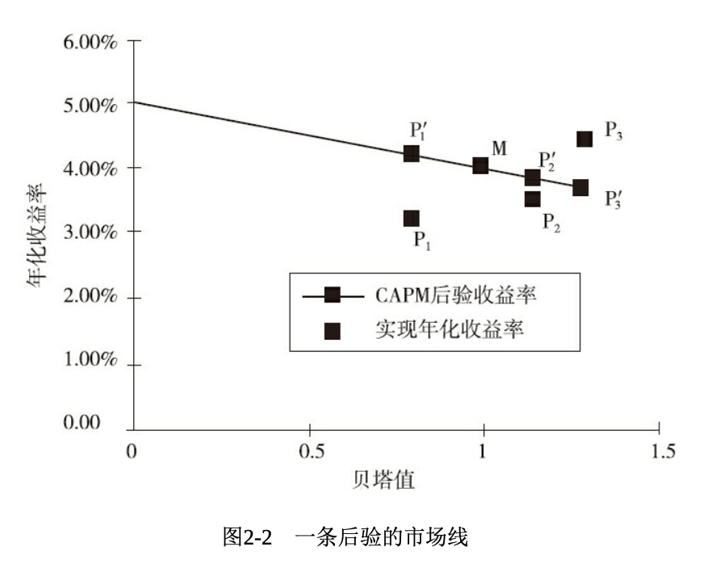
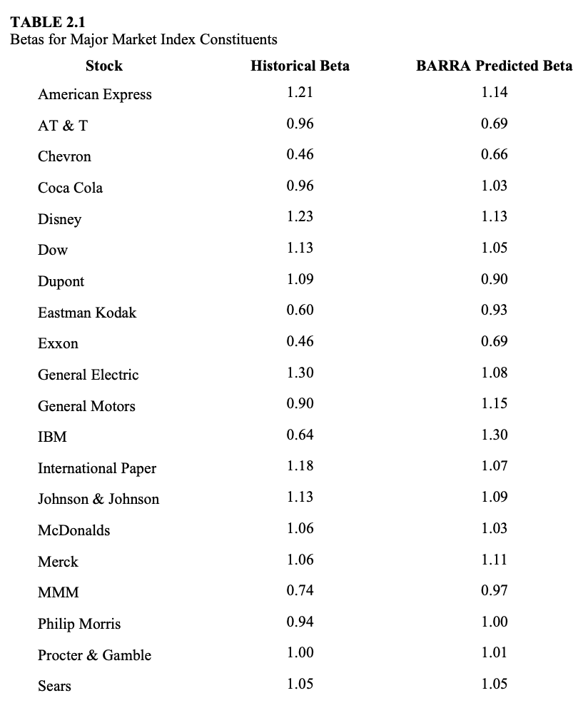

# 第二章 资本资产定价模型 CAPM

资本资产定价模型 Capital Asset Pricing Model CAPM

本章的要点如下:

- 任何股票的收益率都可以分解为**系统性（市场）部分** $\beta$ 和**残差部分** $\alpha$，这是个纯数学分解，不需任何经济理论
- CAPM 要求收益率的残差部分的期望值为0
- CAPM 容易理解，也相对容易实施
- CAPM 背后有一个关于市场有效的强有力的逻辑
- CAPM 认为被动管理是主动管理的一种低风险的替代选择，使主动基金经理需要证明自己的价值
- CAPM 为**一致预期收益率**提供了一个有效来源。主动投资经理的成功程度将与他的预测优于 CAPM 的一致预测的程度相匹配
- CAPM 是关于预期收益率而非风险的

## 收益率分解

- **市场组合**（常记为 M），「所有」资产的组合，代表了「市场」，按定义应该取所有资产的平均，实际常常取某个宽基指数
- **超额收益率** $r$，指资产组合收益减去无风险收益率，无风险收益率常常取国债收益率（也可以取货币基金收益率、或者取为 0），市场组合的超额收益率记为 $r_M$
- 考虑任意一个资产组合 $P$，市场组合记为 $M$，定义组合 $P$ 的 $\beta$ 为，
$$
\beta_P=\frac{\operatorname{cov}(r_P, r_M)}{\operatorname{var}(r_M)}
$$
> 考虑时间序列（如每天的数据），$r$ 就是一个随机变量，在随机变量上定义标准差、方差。因此 $\beta$ 需要定义在一个时间区间上（如某年的 $\beta$）。
>
> $\beta$ 定义的来源是简单的线性回归拟合，考虑时间序列 $t=1,2,3...T$,
> $$r_P(t)=\alpha_p+\beta_P r_M(t)+\epsilon_P(t)$$
> $\beta$ 的上述定义就是这个线性回归的最小二乘解对应的值。
- 得到一个组合的 $\beta$ 之后，就可以将其超额收益率分解为**市场收益率** $r_M$ 和**残差收益率** $\theta_P$,
$$r_P = \beta_P r_M + \theta_P$$
- 残差收益率与市场组合是不相关的，因此其方差也可以分解，$\omega_P^2$ 称为**残差方差**，
$$\sigma_P^2=\beta_P^2\sigma_M^2+\omega_P^2$$
> $$\sigma_P=\operatorname{std}(r_P)$$
> $$\omega_P=\operatorname{std}(\theta_P)$$

这一部分内容是纯数学的收益率分解，与 CAPM 的理论假设无关。

## CAPM

CAPM 假设任何投资组合的预期残差收益率为 0，也即 $E(\theta_P)=0$，于是，

$$E(r_P)=\beta_P E(r_M)=\beta_P \mu_M$$

$\mu_M=E(r_M)$ 称为预期市场超额收益率。**组合投资收益率完全由市场超额收益率和 $\beta$ 决定**。

【CAPM 与有效市场理论】

- 在 CAPM 下，持有异于市场组合的投资者在玩一个零和游戏
- CAPM 与有效市场理论虽不相同，但却是一致的
- 有效市场理论有三种强度，
  - 弱有效形式认为：只使用历史 价格和成交量数据不能战胜市场
  - 半强有效形式认为:只使用公开信息（历史价格、基本面信息、分析师的公开评级等）不能战胜市场
  - 强有效形式认为:投资者无论如何都不能战胜市场（即市场价格包含了一切相关信息）
- CAPM 认为，对于投资者 A 只要不存在「更傻的傻瓜」B，A 就不能战胜市场

【预期收益率与投资组合对应关系】

- 任意定义一个组合为最优，那么任意其他组合的预期超额收益率都将与其对最优组合的贝塔成正比
- 在均值/方差分析框架下，我们可以更一般地将预期收益率和投资组合精确地匹配起来
- 我们称 CAPM 预期收益率为**一致预期收益率**
  - 也即我们在市场组合（一致组合）最优的假设下复原出的预期收益率

## CAPM 与预期收益率

组合的 $\beta$ 与 CAPM 预期收益率可以拟合出一条直线，称为**证券市场线**。直线的纵截距为无风险收益率，斜率为市场的预期超额收益率 $\mu_M$. 

下图是一个市场预期收益率为负的例子，$P_1, P_2, P_3$ 是后验收益率（实现值、真实值），$P_1', P_2', P_3'$ 是 CAPM 预测值，可见在考察时间段内，组合 $P_3$ 创造了附加值（某种意义上战胜了市场）。

将收益率分解为市场部分和残差部分可以帮助主动投资经理研究。

**如果能够控制贝塔，那就没有必要预测市场超额收益率的预期值 $\mu_M$，投资经理转而可以集中精力研究残差收益率的预测。**

## Solutions

### 2.1

在1992年12月，股票西尔斯（Sears）关于标普500指数的贝塔预测值为1.05。如果标普500 指数最终实现的收益率比国库券低5%，那么西尔斯的预期超额收益率是多少?

$$ 1.05 * (-5\%) = -5.25\% $$

### 2.2

如果标普 500 指数的长期预期年化超额收益率为7%，那么西尔斯的预期超额收益率是多少?

$$ 1.05 * 7\% = 7.35\% $$

### 2.3

假设不同股票的残差收益率之间不相关。股票 A 的贝塔值为 1.15，波动率为 35%；股票 B 的贝塔值为 0.95，波动率为 33%。如果市场波动率为 20%，那么股票 A 与股票 B 之间的相关性是多少？哪只股票具有更高的残差波动率?

Review the basic defination,

$$
\begin{align*}
\sigma_A^2 &= \beta_A^2 \sigma_M^2 + \omega_A^2 \\
\sigma_B^2 &= \beta_B^2 \sigma_M^2 + \omega_B^2 \\
\\
r_A &= \beta_A r_M + \theta_A \\
r_B &= \beta_B r_M + \theta_B \\
\end{align*}
$$

We have,

$$
\begin{align*}
\operatorname{cov}(r_A, r_B)
&= \operatorname{cov}(\beta_A r_M + \theta_A, \beta_B r_M + \theta_B) \\
&= \beta_A \beta_B \operatorname{cov}(r_M, r_M) + \beta_A \operatorname{cov}(r_M, \theta_B) + \beta_B \operatorname{cov}(r_M, \theta_A) + 
\operatorname{cov}(\theta_A, \theta_B) \\
&= \beta_A \beta_B \sigma_M^2 \\

\operatorname{corr}(r_A, r_B) &= 
\frac{\operatorname{cov}(r_A, r_B)}{\operatorname{std}(r_A) \operatorname{std}(r_B)} \\
&= \frac{\beta_A \beta_B \sigma_M^2}{\sigma_A \sigma_B} \\
&= \frac{1.15 \times 0.95 \times 0.2^2}
{0.35 \times 0.33} \\
&=0.3784 \\
\\

\omega_A &= \sqrt{\sigma_A^2 - \beta_A^2 \sigma_M^2} \\
&= \sqrt{0.35^2 - 1.15^2 \times 0.2^2} \\
&= 26.38\% \\
\\

\omega_B &= \sqrt{\sigma_B^2 - \beta_B^2 \sigma_M^2} \\
&= \sqrt{0.33^2 - 0.95^2 \times 0.2^2} \\
&= 26.98\% \\
\\
\end{align*}
$$

### 2.4

怎样的一列预期收益率将使我们 100% 投资于 GE (General Electric) 这只股票？

Since GE has the biggest $\beta$, we should invest it if we want height return and ignore the risk.

### 2.5

根据 CAPM，主动投资经理的预期残差收益率是多少？

According to CAPM, an active manager always gets 0 expected residual return.
