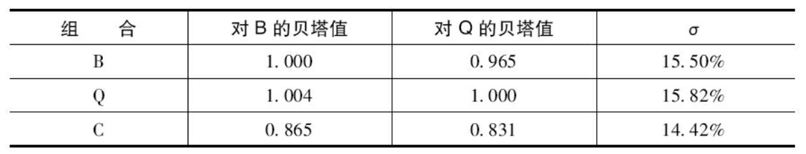

# 第五章 残差风险和残差收益率：信息率

本章要点:

- 【信息率】衡量后验的业绩（向过去看）并意味着先验的机会（向未来看）。
- 信息率定义了残差前沿，即主动投资经理的机会集（可行域）。
- 每位投资经理的信息率及残差风险厌恶水平决定了他的激进程度（残差风险水平）。
- 我们可以基于直觉确定信息率和残差风险厌恶系数的合理数值。
- 【附加值】依赖于投资经理的机会集和激进程度。

本章主要讨论信息率的先验形式（向过去看）。

## 阿尔法

阿尔法已经在本书前几章妥善定义，

$$r_P(t)=\beta_P r_B(t)+\theta_P(t)=\beta_P r_B(t)+\alpha_P+\epsilon_P(t)$$

$\alpha_P$ 是残差收益率 $\theta_P$ 的期望。$\alpha$ 具有可加性，如果两个股票的 $\alpha$ 分别为 $\alpha_1, \alpha_2$ 持仓权重分别为 $h_P(1), h_p(2)$ 则组合的 $\alpha$ 是，

$$\alpha_P=h_P(1)\alpha_1+h_P(2)\alpha_2$$

## 后验信息率

信息率是（年化）残差收益率与（年化）残差风险的比值。

$$\mathit{IR}_P = \frac{\alpha}{\omega}$$

基金经理能实现的最高的信息率称为基金经理的信息率（有别于基金的信息率）。信息率不依赖于投资经理的激进程度。投资经理可以通过主动仓位比例增加 $\alpha$ 但也会同时增加 $\omega$ 因而不会改善信息率。

基金经理在其最高信息率约束下能够实现的 $\alpha$ 和 $\omega$ 函数曲线（是一条直线）称为残差前沿，残差前沿约束了基金经理的机会集。

## 主动投资经理的目标函数

主动管理的目标是最大化【附加值】，附加值定义为，

$$\operatorname{VA}[P]=\alpha_P-\lambda_R\omega_P^2$$

把信息率的定义带入该式，可以得到最优残差水平 $\omega^*=\frac{\mathit{IR}}{2\lambda_P}$ 以及最佳附加值 $\mathit{VA}^*=\frac{\omega^* \mathit{IR}}{2}$

> 信息率与夏普比率的区别主要是夏普比率的「基准」是无风险收益率，而信息率的「基准」是业绩基准。信息率与「超额收益夏普比率」近似。

## 问题

**1.** 一位被动投资经理的信息率大约为多少？

> 被动投资经理的主动仓位是 0，$\alpha$ 和 $\omega$ 都是 0，其信息率是没有定义。

**2.** 如果风险厌恶系数是0.10（中等水平），那么为了创造 2.5% 的风险调整收益率，需要多高的信息率?在该情形下，投资经理需要承担多高的主动风险？

> $$\operatorname{VA}[P]=\alpha_P-\lambda_R\omega_P^2$$
> $$\omega^*=\frac{\mathit{IR}}{2\lambda_P}$$
> $$\textit{VA}^*=\frac{\textit{IR}^2}{4\lambda}$$
> $$\textit{IR}=\sqrt{4\lambda\textit{VA}}=\sqrt{4 \times 0.1 \times 2.5}=1$$
> $$\omega^*=\frac{1}{2\times 0.1}=5\%$$

**3.** 从主要市场指数（MMI）的成分股开始，我们作出如下假设：

- Q 是 MMI 组合
- $f_Q=6\%$
- B 是市值加权 MMI 组合

我们计算得到（截止至 1995 年 1 月）：

其中组合 C 是最小风险（全额投资）组合。对于每一个组合（Q、B 和 C），计算 $f, \alpha, \omega$，SR 和 IR。

> 组合 B（业绩基准），
> $$\alpha_B=0,\, \omega_B=0,\, \textit{IR} \text{ is undefined}$$
> $$f_B=\beta_{BQ}f_Q=0.965\times 6\%=5.79\%$$
> $$\textit{SR}_B = \frac{f_B}{\sigma_B}=\frac{5.79\%}{15.50\%}=0.374$$
> 
> 组合 Q，
> $$f_Q=6\%$$
> $$\textit{SR}_Q = \frac{f_Q}{\sigma_Q}=\frac{6\%}{15.82\%}=0.379$$
> $$\alpha_Q=f_Q-\beta_{QB}f_B=6\%-1.004*5.79\%=0.187\%$$
> $$\omega_Q=\sqrt{\sigma_Q^2-\beta_{QB}^2\sigma_B^2}=\sqrt{15.82^2-1.004^2\times15.5^2}\%=2.845\%$$
> $$\textit{IR}_Q=\frac{\alpha_Q}{\omega_Q}=0.066$$
>
> 组合 C，
> $$f_C=\beta_{CB}f_B/\beta_{QB}=0.865\times 5.79\%/1.004=4.988\%$$
> $$\textit{SR}_C = \frac{f_C}{\sigma_C}=\frac{4.988\%}{14.42\%}=0.346$$
> $$\alpha_C=f_C-\beta_{CB}f_B=4.988\%-0.865*5.79\%=-0.020\%$$
> $$\omega_C=\sqrt{\sigma_C^2-\beta_{CB}^2\sigma_C^2}=\sqrt{14.42^2-0.865^2\times15.5^2}\%=5.308\%$$
> $$\textit{IR}_C=\frac{\alpha_C}{\omega_C}=-0.0038$$

**4.** 你的残差风险厌恶系数为 $\lambda_R=0.12$，信息率为 $\textit{IR}=0.60$。那么你的最优残差风险水平是多少？你的最优附加值是多少？

> $$\omega^*=\frac{\textit{IR}}{2\lambda_R}=2.5\%$$
> $$\textit{VA}^*=\frac{\textit{IR}^2}{4\lambda_R}=0.75\%$$

**5.** 哎呀！很遗憾，你的信息率实际上只有 $\textit{IR}=0.30$。那么如果你根据问题 4 的结果设置你的残差风险水平，你会损失多少附加值？

> 按照问题 4 实现的附加值为：
> $$\textit{VA}_4=\textit{IR}\cdot\omega_4-\lambda_R\omega_4^2=0.3\times 2.5\%-0.12\times 2.5^2\%=0$$
> 最优附加值为：
> $$\textit{VA}^*=\frac{\textit{IR}^2}{4\lambda_R}=0.1875\%$$
> 所以损失了 0.1875% 附加值。

**6.** 你是一位主动投资经理，具有信息率 $\textit{IR}=0.50$（前1/4），并且目标残差风险水平是4%。当残差风险厌恶系数是多少时，会得到这样的残差风险水平?

> $$\lambda_R=\frac{\textit{IR}}{2\omega^*}=0.0625\%$$
