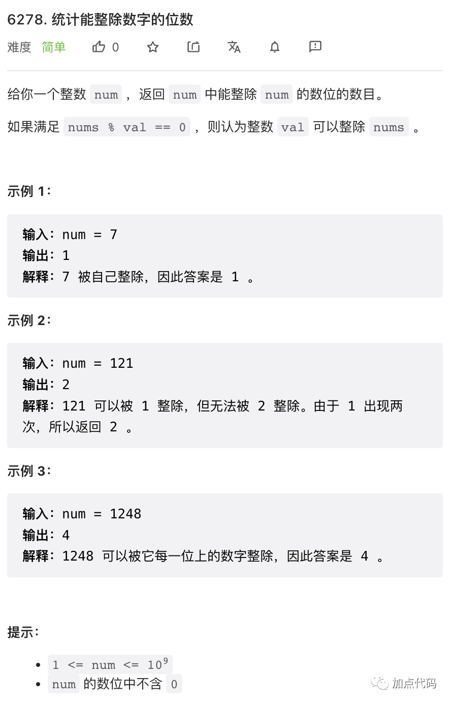
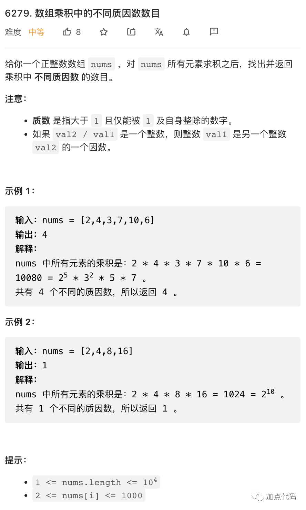
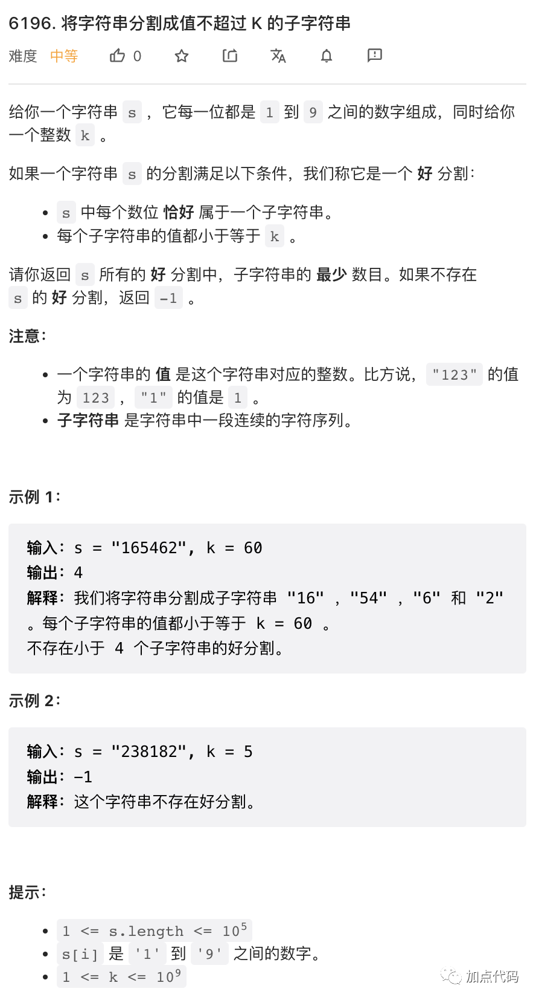
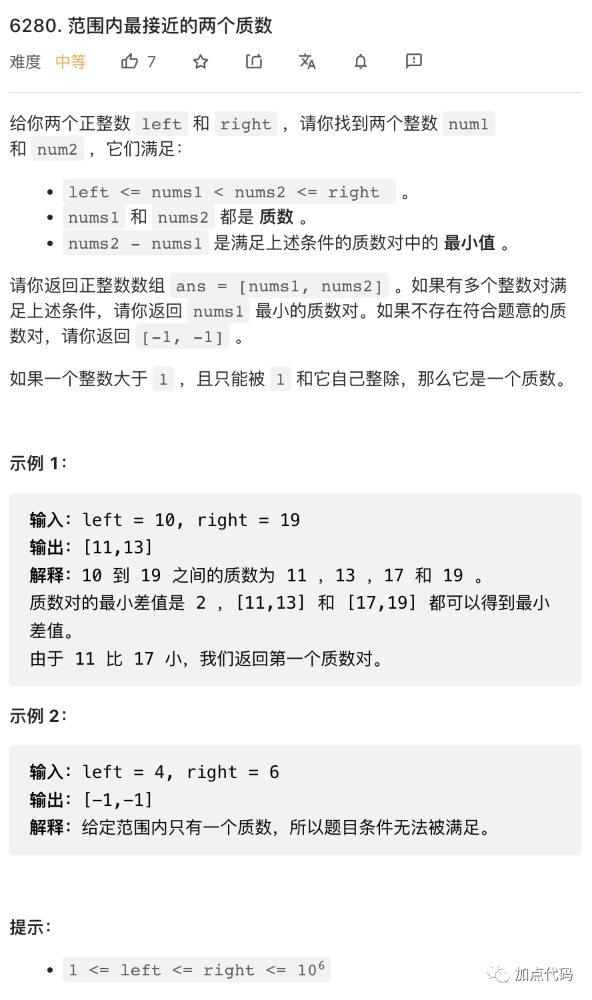

上周休假休息一周，本周题解继续！今天有两道质数相关题目，可以分享一下质因数分解和质数表模板。

## 1.



较为简单的一道题目，`num` 转字符串，其中每个字符测试一下就可以了。

```py
class Solution:
    def countDigits(self, num: int) -> int:
        return sum(1 for c in str(num) if num % int(c) == 0)
```

## 2.



`nums` 之积的质因数分解列表，就等于其每一个数字质因数分解列表合并。合并后数一下去重之后的数字个数就可以了。

本题给出一个质因数分解函数模板。这个模板能够在 `O(N^0.5)` 的时间复杂度下进行质因数分解，而且常数极小，几乎能够对 `int32` 范围内的任何整数进行分解。模板特殊处理了 `2` 所以主要循环能够以 `2` 为步长，加快速度。

```cpp
template <typename NUM = int>
void prime_fact(NUM num, std::vector<NUM>& res) {
    while (num % 2 == 0) {
        num /= 2;
        res.push_back(2);
    }
    for (int p = 3; p * p <= num; p += 2) {
        while (num % p == 0) {
            res.push_back(p);
            num /= p;
        }
    }
    if (num > 1) res.push_back(num);
}

class Solution {
public:
    int distinctPrimeFactors(vector<int>& nums) {
        vector<int> facts;
        for(int x: nums) {
            prime_fact(x, facts);
        }
        sort(facts.begin(), facts.end());
        int res = 0;
        for(int i = 0; i < int(facts.size()); i++) {
            if(i == 0 or facts[i] != facts[i - 1]) {
                res++;
            }
        }
        return res;
    }
};
```

## 3. 



也是较为简单的一道题目，不难证明，我们可以贪心的进行划分，从左开始，每个分组尽可能的多加入字符。

如果遇到某个字符大于 `k` 则划分是不可能的。

```py
class Solution:
    def minimumPartition(self, s: str, k: int) -> int:
        res = curr = 0
        for c in s:
            x = int(c)
            if x > k:
                return -1
            if curr * 10 + x > k:
                # 需要另开一组
                res += 1
                curr = 0
            curr = curr * 10 + x
        # 上方的循环最后总是会剩下一组，所以最终结果要加一
        return res + 1
```

## 4. 



这个题目，如果能够求出 left, right 之间所有质数，则是非常简单的。

有一个著名的素数筛算法能够求小于 N 的所有整数中素数列表。这里给出的模板函数，配合 `vector<bool>` 数据结构，时间和空间效率极高，能够在数秒钟之内求出 1E9 范围内的素数。这个算法的时间复杂度是 `O(n)` 的，且常数非常小。这个模板函数能暴力过掉一些数据规模很大的题目。

`vector<bool>` 是 C++ 的一个特殊数据结构，它并不是 `vector<>` 模板类对 `bool` 类型的实例化，而是一个特殊实现的类似于 bitmap 的数据结构。它能够以大约 `O(N/32)` 的速度初始化，并且每个元素只占据一个 bit. 但使用时小心，它并不是一般的 `vector<>` 它的行为有时候有点古怪。

```cpp
// this function can get primes less than 1E9 in 4 seconds.
// all flags should be init as true
// assert flags.size() >= 2
void prime_flags(std::vector<bool>& flags) {
    int lim = int(flags.size());
    flags[0] = flags[1] = false;
    for (int n = 4; n < lim; n += 2) {
        flags[n] = false;
    }
    for (int n = 3; n * n <= lim; n += 2) {
        if (flags[n]) {
            for (int t = n * 3; t < lim; t += n << 1) {
                flags[t] = false;
            }
        }
    }
}

class Solution {
public:
    vector<int> closestPrimes(int left, int right) {
        vector<bool> flags(right + 1, true);
        prime_flags(flags);
        int last = -1, mini = right, x = -1, y = -1;
        for(int i = left; i <= right; i++) {
            if(flags[i]) {
                if(last != -1 and i - last < mini) {
                    mini = i - last;
                    x = last, y = i;
                }
                last = i;
            }
        }
        return {x, y};
    }
};
```
