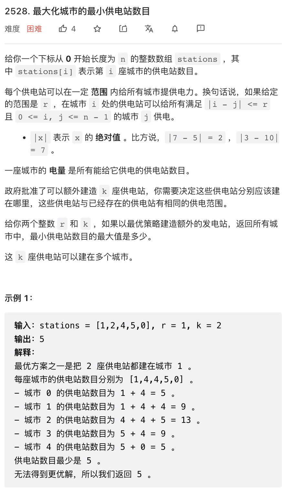

本周周赛中规中矩，但我感觉第三题公式推导比第四题还难。。。

## 1.


「翻译」题目，把题目文本用代码写出来就行了。

```py
class Solution:
    def categorizeBox(self, length: int, width: int, height: int, mass: int) -> str:
        bulky = max(length, width, height) >= 10 ** 4 or length * width * height >= 10 ** 9
        heavy = mass >= 100
        if bulky and heavy:
            return "Both"
        if not bulky and not heavy:
            return "Neither"
        if bulky and not heavy:
            return "Bulky"
        return "Heavy"
```

## 2.


滑动窗口题目。可以维护一个滑动窗口，并维护窗口中等于 `value` 的数字个数。

```cpp
class DataStream {
    queue<int> nums;
    int eq, value, k;
public:
    DataStream(int value, int k): eq(0), value(value), k(k) {}
    
    bool consec(int num) {
        nums.push(num);
        // 若 num == values 则更新 eq
        eq += num == value;

        // 窗口元素多于 k 则 pop 一个
        if(nums.size() > k) {
            eq -= nums.front() == value;
            nums.pop();
        }
        return eq == k;
    }
};
```

## 3. 


这个题目的推导有些意思。推导后的结果是，待求值就等于所有输入数字的 xor. 推导过程写在注释中。

我感觉这个题目的推导是要比第四题难的，xor 跟 |, & 可交换得好好证明一会儿。

```py
## xor(i, j, k) 代表关于所有 i, j, k 下表组合进行 xor
# xor(i, j, k) (x[i] | x[j]) & x[k]
# => xor(i, j) xor(k) (x[i] | x[j]) & x[k]
## 可以证明， (x & y1) ^ (x & y2) = x & (y1 ^ y2)
## 这个证明可以按位进行，在一个 bit 位上穷举即可
# => xor(i) xor(j) (x[i] | x[j]) & (xor(k) x[k])
## 类似可以证明，(x | y1) ^ (x | y2)= x | (y1 ^ y2)
# => xor(i) (x[i] | xor(j) x[j]) & (xor(k) x[k])
# => (xor(i) x[i]) | (xor(j) x[j]) & (xor(k) x[k])
# => xor(i) x[i]
class Solution:
    def xorBeauty(self, nums: List[int]) -> int:
        return functools.reduce(lambda x, y: x ^ y, nums)
```

## 4. 




这是一道二分答案+滑动窗口+贪心的题目。

使用二分答案方法的前提是，验证一个答案要比求解容易得多。本题中，验证能否到达某个供电站数目确实比较容易。我们只需要从左到右考察，某个城市如果供电站树木达不到目标，就在距离它右侧 `+ r` 位置上加一座供电站即可。这里是一个贪心，我们很容易理解，既然是从左到右考察，把供电站摆放在最右侧是最优的。至于快速求解一个城市的可达的供电站数量，可以借助一个滑动窗口求和完成。

```cpp
class Solution {
public:
    long long maxPower(vector<int>& stations, int r, int k) {
        int n = stations.size();
        // 二分搜索的左右边界，右边界（最大可能的供电站数量）可以取为供电站总数 + k，或者用一个固定的大数字也可以，比如 2E10
        // 注意本题供电站数量可以超过 INT_MAX 需要使用 long long 也即 int64
        long long left = 0, right = accumulate(stations.begin(), stations.end(), 0LL) + k;
        
        while(left < right) {
            // 我们有可能在一些城市新建供电站，因此拷贝一份城市供电站数量作为初始值
            // 由于计算逻辑，供电站数量可以超过 INT_MAX，long long 保险
            vector<long long> st(stations.begin(), stations.end());
            // 求和窗口中总供电站数量，初始化为左侧 r - 1 个城市总供电站数量
            long long total = accumulate(st.begin(), st.begin() + r, 0LL);
            // 二分法本轮检查 mid 个数的供电站能否达到
            // used 是已经新建的供电站数量
            long long mid = (left + right + 1) / 2, used = 0;

            for(int i = 0; i < n and used <= k; i++) {
                // 更新滑动窗口，右侧加入，左侧弹出
                total += i + r < n ? st[i + r] : 0;
                total -= i - r - 1 >= 0 ? st[i - r - 1] : 0;
                // 需要新建的供电站数量
                long long needed = mid - total;
                if(needed > 0) {
                    // 新建供电站，注意这里修改了每座城市中的电站数量 st
                    // 滑动窗口弹出时需要使用这里修改之后的 st 而不是初始值
                    // 小心这个位置的逻辑可以导致 st 中的 value 大于 INT_MAX
                    used += needed;
                    total += needed;
                    st[min(i + r, n - 1)] += needed;
                }
            }
            
            // 根据检查成功与否，更新二分左右边界
            if(used <= k) {
                left = mid;
            } else {
                right = mid - 1;
            }
        }
        return left;
    }
};
```
