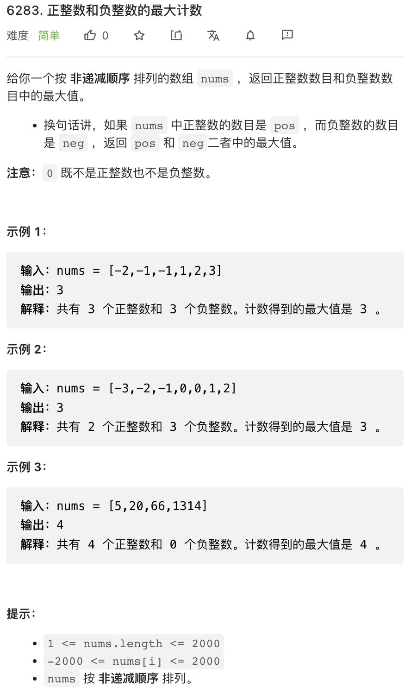
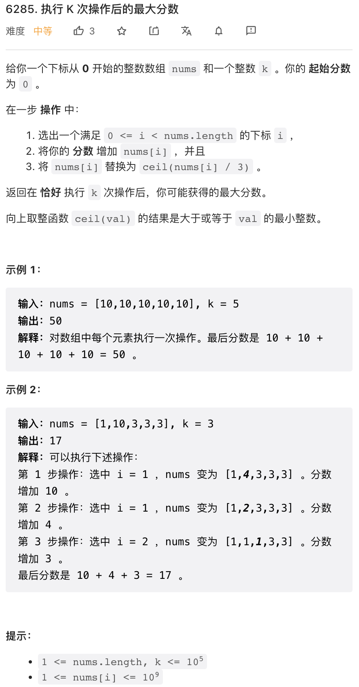
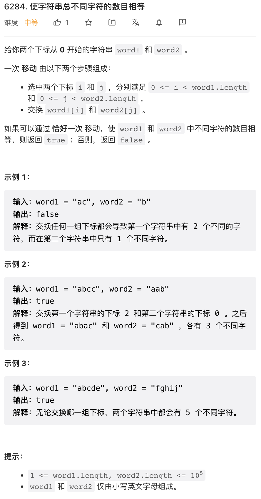
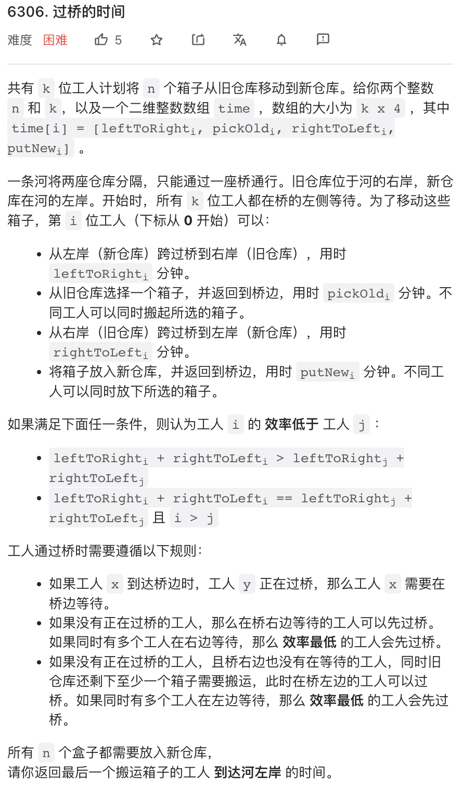
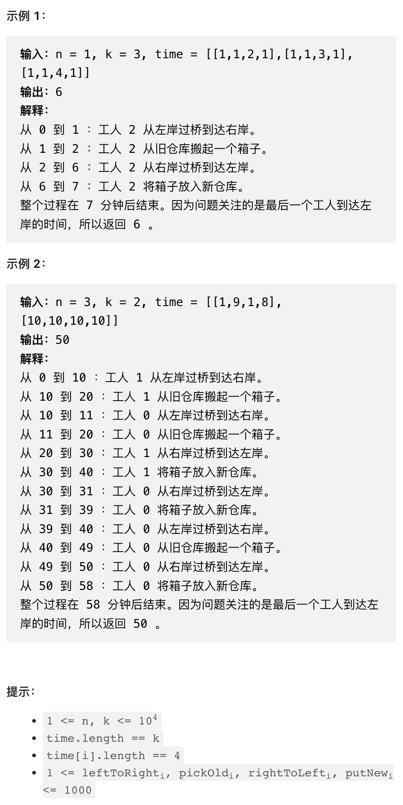

本周周赛跟优先队列过不去，第二题、第四题总共使用了 5 个优先队列。。

## 1.



按题述要求实现即可。

```py
class Solution:
    def maximumCount(self, nums: List[int]) -> int:
        return max(sum(1 for x in nums if x > 0), sum(1 for x in nums if x < 0))
```

## 2.



这个题目可以使用优先队列模拟。每次操作时从优先队列取出最大元素，操作之后将 `x / 3` 放回优先队列即可。

练习一下 Python 优先队列 API.

```py
class Solution:
    def maxKelements(self, nums: List[int], k: int) -> int:
        nums = [-x for x in nums]
        heapify(nums)
        res = 0
        while k:
            k -= 1
            res += -nums[0]
            heappushpop(nums, nums[0] // 3)
        return res
```

## 3. 



本题应该有很多种不同的解法。这里的解法的思路是，一次操作无非是交换了两个字母，我们可以先统计 `word1, word2` 中不同字母的数量，然后枚举被交换的字母（共有 `26 * 26` 种情况需要枚举），每种情况检查不同字母数量是否相等即可。

```py
class Solution:
    def isItPossible(self, word1: str, word2: str) -> bool:
        N = 26
        
        # 字母计数
        c1, c2 = [0] * N, [0] * N
        bias = ord('a')
        for c in word1:
            c1[ord(c) - bias] += 1
        for c in word2:
            c2[ord(c) - bias] += 1
        
        # 不同字母个数
        d1 = sum(1 for x in c1 if x != 0)
        d2 = sum(1 for x in c2 if x != 0)
        
        # 尝试交换 word1 中字母 i 与 word2 中字母 j
        for i in range(N):
            # 如果 word1 不含 i 则跳过
            if c1[i] == 0:
                continue
            for j in range(N):
                # 如果 word2 不含 j 则跳过
                if c2[j] == 0:
                    continue

                if i != j:
                    # 如果 i, j 不想等，则 word1 失去一个 i, word2 失去一个 j
                    # 推算交换后的不同字母个数
                    _d1 = d1 + (c1[j] == 0) - (c1[i] == 1)
                    _d2 = d2 + (c2[i] == 0) - (c2[j] == 1)
                    if _d1 == _d2:
                        return True
                elif d1 == d2:
                    # 如果 i, j 相等，d1, d2 不变
                    return True
        # 没有搜索到合理解
        return False
```

## 4. 




这道题目其实不是很难，因为暴力模拟就可以了。但比较麻烦。

在暴力模拟思路就是枚举每个「关键时刻」的行动。每个时刻，有这样几个关键点需要处理：

- 左右两岸等待的工人，按照题述逻辑决定某个工人过桥，可以左右分别使用一个优先队列决定过桥顺序
- 正在 pick or put 的工人，如果完成工作则加入等待序列，可以分别使用一个优先队列来选取完成工作的工人

于是，总计需要使用四个优先队列。

这种题目思路上不难，难点在于设计一个比较简洁的实现，并保证没有 BUG 实现出来。

```cpp
class Solution {
public:
    int findCrossingTime(int n, int k, vector<vector<int>>& time) {
        
        // 左右两岸等待的工人，pair 两个元素分别是 efficiency 和 工人 id
        priority_queue<pair<int, int>> left, right;  // worker <eff, id>

        // 正在 pick & put 的工人，pair 第一个元素工作完成的时间取负 -time
        // 负号是因为 C++ 优先队列是逆序排序
        priority_queue<pair<int, int>> pick, put;  // worker <-time, id>
        
        // 计算 efficiency 并将所有工人加入左岸等待队列
        vector<int> eff(k);
        for(int i = 0; i < k; i++) {
            eff[i] = time[i][0] + time[i][2];
            left.push({eff[i], i});
        }
        
        // last: 最后一个工人回到左岸时刻
        // curr: 当前时刻
        // 由于桥只能有一个工人走，所以重点考察桥上的逻辑
        int last = 0, curr = 0;

        // 还有剩余货物或者还有工人没有回来
        while(n > 0 or right.size() or pick.size()) {
            // 完成 pick 的工人
            while(pick.size() and -pick.top().first <= curr) {
                int w = pick.top().second;
                pick.pop();
                right.push({eff[w], w});
            }
            // 完成 put 的工人
            while(put.size() and -put.top().first <= curr) {
                int w = put.top().second;
                put.pop();
                left.push({eff[w], w});
            }
            // 过桥逻辑
            // 按照题述，先处理右岸等待
            if(right.size()) {
                int w = right.top().second;
                right.pop();
                // 开始过桥之后，直到完成 pick 都不会再等待
                // 过桥后再次进入等待的时刻
                int _nt = -curr - time[w][2] - time[w][3];
                // 直接加入 put 队列等待
                put.push({_nt, w});
                last = max(last, curr + time[w][2]);
                curr += time[w][2]; // 占用桥 time[w][2] 时间
            } else if(left.size()) {
                int w = left.top().second;
                left.pop();
                // 仅当还有剩余货物时，再次出发
                if(n) {
                    n--;
                    // 与右侧逻辑类似
                    int _nt = -curr - time[w][0] - time[w][1];
                    pick.push({_nt, w});
                    curr += time[w][0];
                }
            } else {
                // 如果两侧都没有人在等待，则检查一下正在 pick & put 的工人
                // 将最近一个工人完成工作的时间点设置为 curr
                int t1 = pick.size() ? -pick.top().first : INT_MAX;
                int t2 = put.size() ? -put.top().first : INT_MAX;
                curr = min(t1, t2);
            }
        }
        
        return last;
    }
};
```
