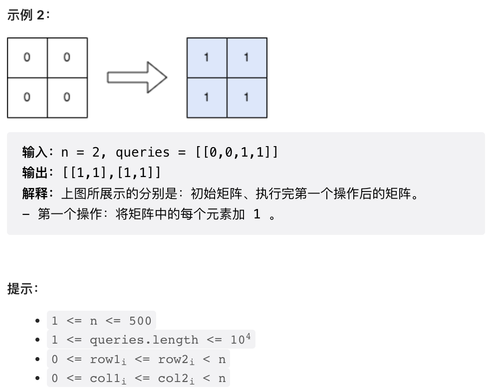

## 1.


```py
class Solution:
    def differenceOfSum(self, nums: List[int]) -> int:
        return abs(sum(nums) - sum(int(c) for x in nums for c in str(x)))
```

## 2.




这道题目有点意思。很明显，直接暴力标记是不可行的，因为每次标记的区域可以很大，最终时间复杂度会是 `O(n^2*m)`, m 是 Query 数量。

这里给出一种可能并非最优的 `O(mn)` 的做法，足够过掉这一道题目。基本思路是，对于每个 Query, 先在 Query 覆盖区域的每一行上标记起始和结束位置，全部 Query 标记完后再逐行运行类似于前缀和的算法即可。

```py
class Solution:
    def rangeAddQueries(self, n: int, queries: List[List[int]]) -> List[List[int]]:

        res = [[0] * n for _ in range(n)]
        for r1, c1, r2, c2 in queries:
            # 在 Query 覆盖区域标记每一行的开始和结束位置
            # 注意这里的逻辑结束位置要标记在覆盖区域的下一格（前闭后开区间）
            for r in range(r1, r2 + 1):
                res[r][c1] += 1
                if c2 + 1 < n:
                    res[r][c2 + 1] -= 1
        
        for row in res:
            pre = 0
            for i in range(n):
                # 类前缀和逻辑
                # 第一轮标记直接标记在了 res 矩阵中，然后原地求前缀和
                # 节省一点空间，并更加简洁，但实现时需要稍加小心，下方两行顺序不能颠倒
                pre += row[i]
                row[i] = pre
        
        return res
```


```cpp
class Solution {
public:
    vector<vector<int>> rangeAddQueries(int n, vector<vector<int>>& queries) {
        vector<vector<int>> res(n, vector<int>(n));
        for(auto& v: queries) {
            // 在 Query 覆盖区域标记每一行的开始和结束位置
            // 注意这里的逻辑结束位置要标记在覆盖区域的下一格（前闭后开区间）
            for(int r = v[0]; r <= v[2]; r++) {
                res[r][v[1]]++;
                if(v[3] + 1 < n) {
                    res[r][v[3] + 1]--;
                }
            }
        }
        for(int r = 0; r < n; r++) {
            int d = 0;
            for(int c = 0; c < n; c++) {
                // 类前缀和逻辑
                // 第一轮标记直接标记在了 res 矩阵中，然后原地求前缀和
                // 节省一点空间，并更加简洁，但实现时需要稍加小心，下方两行顺序不能颠倒
                d += res[r][c];
                res[r][c] = d;
            }
        }
        return res;
    }
};
```

## 3. 


本题可以视为滑动窗口题目的变体。一个子列中相等数对的数量可以通过统计每个数字出现的次数得到。使用滑动窗口统计，当已经有 `n` 个数字时，再加入一个数字，增加的相等数对个数恰好是 `n`. 可以使用一个 map 来统计不同的数字出现的频次。

另外，由于本题要求统计所有满足条件的子列，枚举将会超时。这里使用一种滑动窗口题目中常见的技巧，我们固定右端点，然后寻找第一个【不】符合条件的左端点，然后这个端点左侧的端点都是符合条件的。

```cpp
class Solution {
public:
    long long countGood(vector<int>& nums, int k) {
        unordered_map<int, int> win;  // <数字，频次>
        // total 是窗口中满足条件的数对总个数
        long long res = 0, total = 0;
        for(int left = 0, right = 0; right < nums.size(); right++) {
            // 右端点入窗口，更新 win & total
            // 注意 ++ 操作符在右侧时返回更新之前的值
            total += win[nums[right]]++;
            // 搜索第一个不符合条件的左端点
            while(total >= k) {
                // 左端点出窗口
                // 注意 -- 操作符在左侧时返回更新之后的值
                total -= --win[nums[left++]];
            }
            // left 左侧共有 left 个点
            res += left;
        }
        return res;
    }
};
```

## 4. 


对于最大路径和的计算，考虑暴力计算，则需要以每个节点为根进行 DFS 求最长路径。这样会有大量重复计算。考虑 DFS 的过程，实际上当 parent 节点固定时，当前节点对应的子树搜索到的最大路径和就是固定的。因此，可以在 DFS 基础上进行自顶向下 DP, DP 空间就会是 `(当前节点，parent 节点)`. 这个 pair 恰好是一条边，DP 状态就可以存储在边上。

这个问题的 DP 空间大小就是边的数量，时间复杂度也是 `O(m)`, `m` 是边的数量。

这个解法实际上时间复杂度是有问题的。由于对每个状态的求解最多需要 `O(m)` 的时间复杂度，这个解法实际上是 `O(m^2)` 复杂度，这种复杂度在 `n-1` 个节点都连接到根节点时确实会出现。但由于 LeetCode 数据太弱，被我们水过去了。时间复杂度真正正确的接发可以参考：

https://leetcode.cn/problems/difference-between-maximum-and-minimum-price-sum/solution/by-endlesscheng-5l70/

最小路径和显然是根节点单个节点。

```cpp
// 这个数据结构是重点！
// 一条边，<子节点 id, 该子节点作为 parent 节点的当前子树最长路径长度>
typedef pair<int, long long> Child;
// 一个节点的所有子节点
typedef vector<Child> ChildVec;

class Solution {
public:
    long long maxOutput(int n, vector<vector<int>>& edges, vector<int>& price) {
        // 建图
        vector<ChildVec> g(n);
        for(auto& p: edges) {
            g[p[0]].push_back({p[1], -1LL});
            g[p[1]].push_back({p[0], -1LL});
        }
        // 将子节点排序，之后会使用二分法根据 ID 查找子节点
        for(auto& v: g) {
            sort(v.begin(), v.end());
        }
        // 穷举每个节点作为根节点时的最长路径
        long long res = 0;
        for(int i = 0; i < n; i++) {
            res = max(res, dfs(g, price, i, -1) - price[i]);
        }
        return res;
    }
    // 求解指定 parent 节点时，node 节点对应的子树中最大路径和
    // 对于根节点，parent = -1
    long long dfs(vector<vector<pair<int, long long>>>& g, vector<int>& price, int node, int parent) {
        // 使用二分法从近邻节点中找到 parent 节点，检查是否已经计算
        ChildVec::iterator p;
        if(parent != -1) {
            p = lower_bound(g[node].begin(), g[node].end(), make_pair(parent, -1LL));
            if(p->second != -1) {
                return p->second;
            }
        }
        
        // 如果没有计算，则递归计算所有子节点的最大路径和
        long long res = 0;
        for(auto& p: g[node]) {
            if(p.first != parent) {
                res = max(res, dfs(g, price, p.first, node));
            }
        }

        // 更新 DP 状态，返回结果
        res += price[node];
        if(parent != -1) {
            p->second = res;
        }
        return res;
    }
};

```
