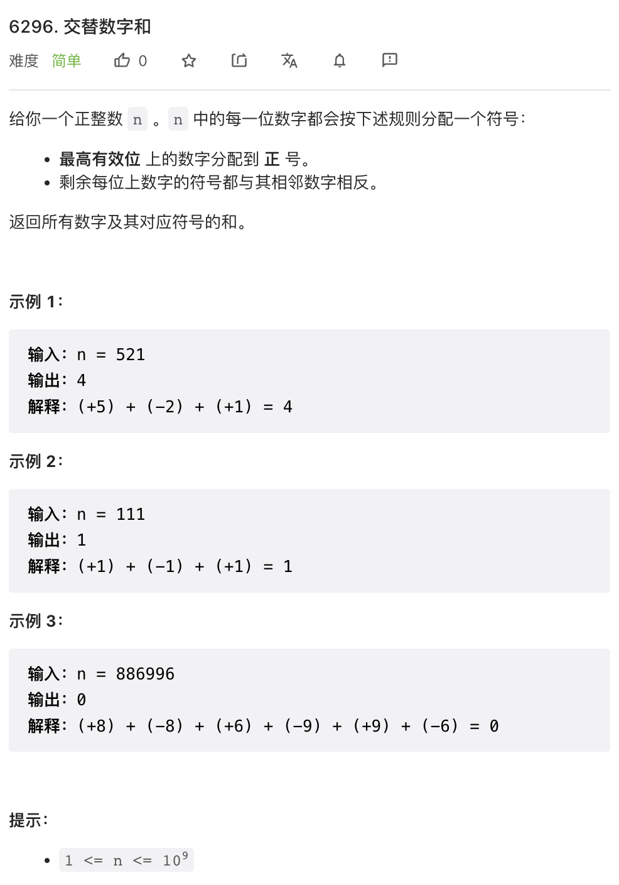
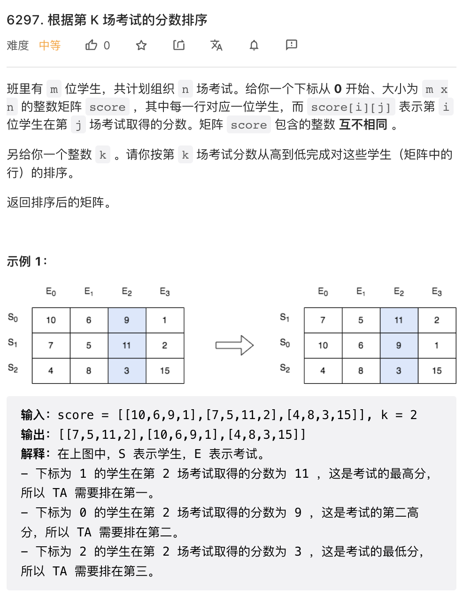
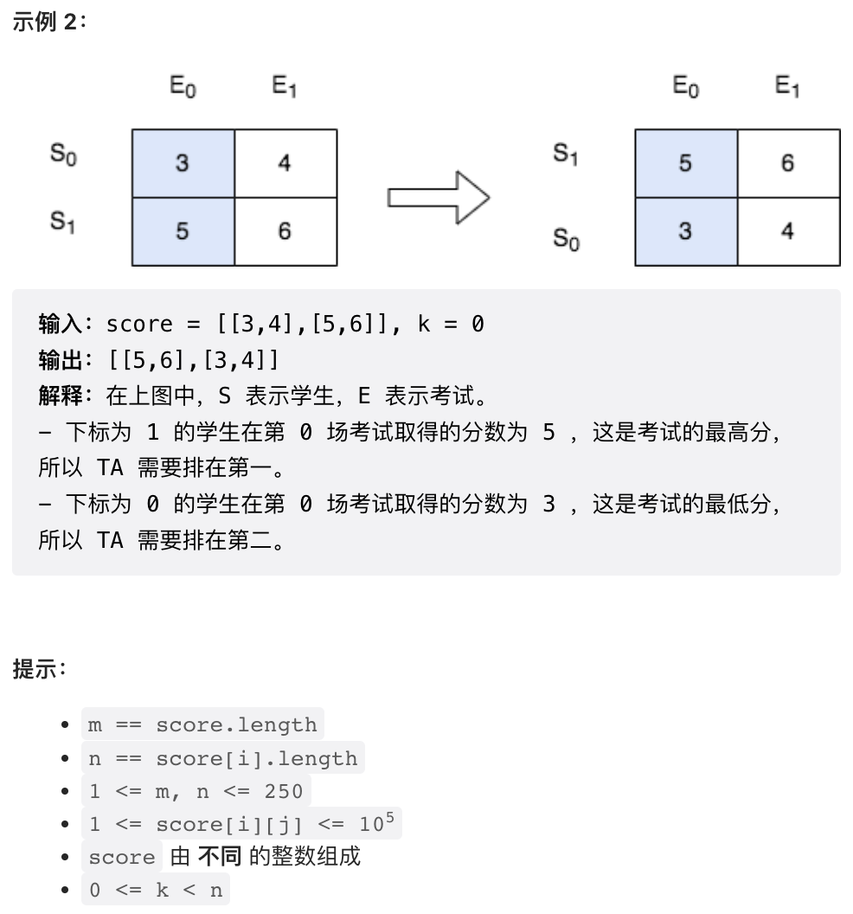
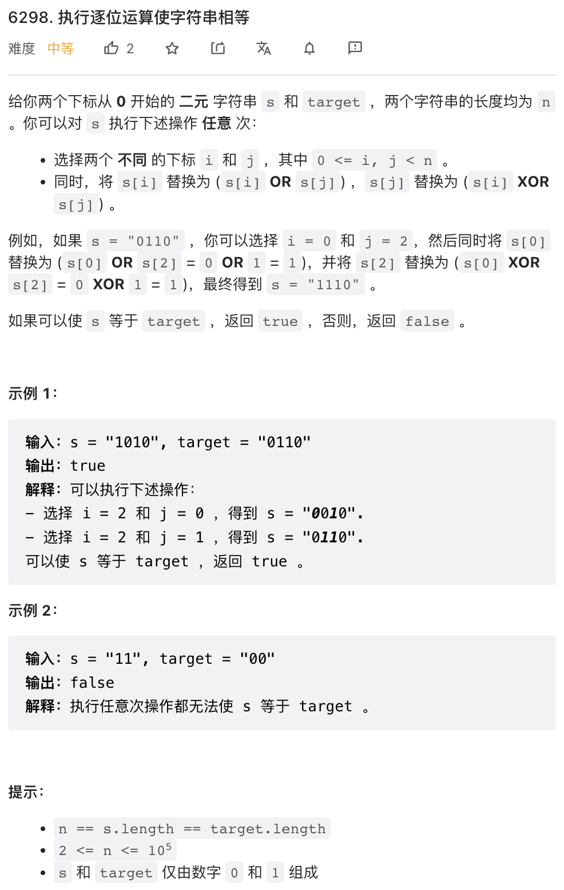
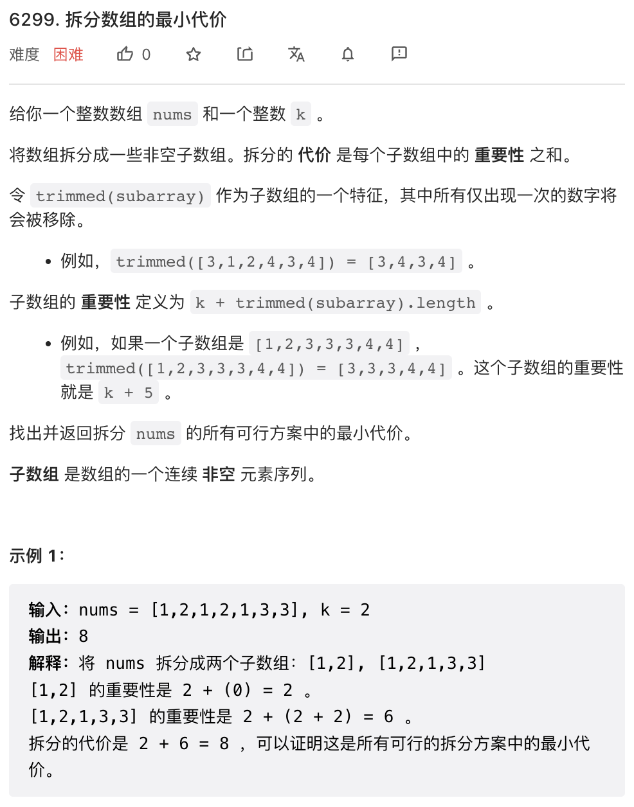
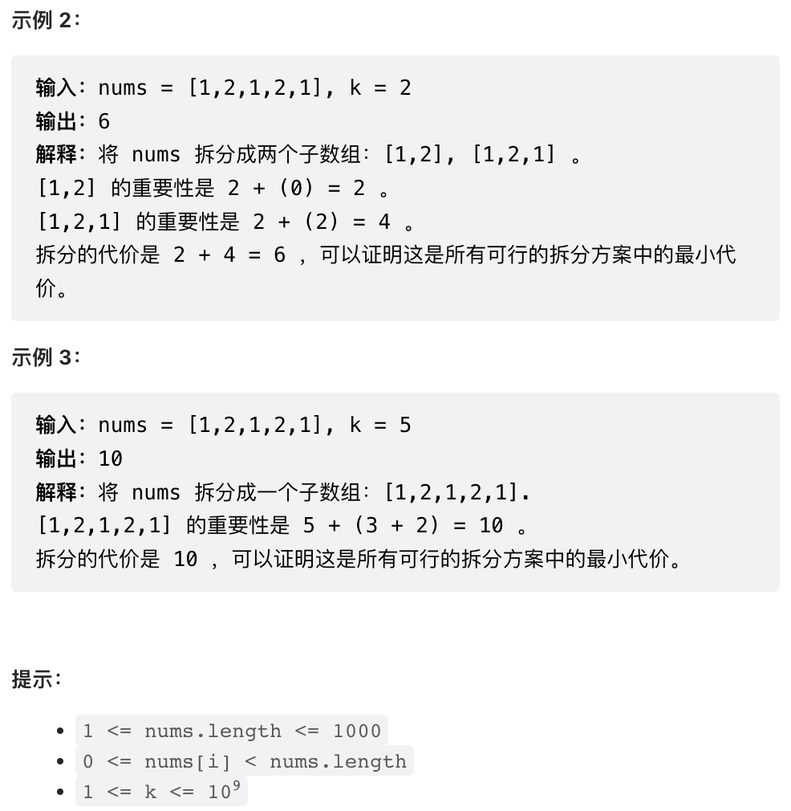

大年初一新年好！祝大家兔年心想事成没有 BUG！本周周赛题目前两题都可以一行代码过，第三题和第四题有点意思，但难度不大。

## 1.



比较简单的一道题目，按要求操作即可。

```py
class Solution:
    def alternateDigitSum(self, n: int) -> int:
        return sum(int(c) * (-1) ** i for i, c in enumerate(str(n)))
```

## 2.




感觉比第一题还简单，Python 的排序函数恰好可以满足要求，注意逆序。

```py
class Solution:
    def sortTheStudents(self, score: List[List[int]], k: int) -> List[List[int]]:
        return sorted(score, key=lambda x: x[k], reverse=True)
```

## 3. 



这个题目有点意思，可以列一个表，枚举 `s[i], s[j]` 不同取值时的结果。注意 `i,j` 不要求 `i < j`，所以实际上是无序的。

根据列表可以看出，01 or 10 可以容易的转变成 11, 11 可以容易的转变成 01, 01（再次强调 `i,j` 可以任意交换），不难发现这几乎可以任意翻转 bit 位，只要 s 中有一个 1, 借助这个 1 就可以随意翻转任意其他比特位。只有两个例外：如果 target 是全 0，则 s 必须是全零。反之亦然，如果 s 是全零，则 target 也必须全零。

```py
# 00->00
# 01->11
# 10->11
# 11->10
class Solution:
    def makeStringsEqual(self, s: str, target: str) -> bool:
        n = len(s)
        s0, t0 = s.count('0'), target.count('0')
        s1, t1 = n - s0, n - t0
        if t0 == n:
            return s0 == n
        return s1 != 0
```

## 4. 




这是一道典型的 DP 题目。LeetCode 上有很多相似的题目，大家一般很有经验解决类似问题。

首先，很容易想到这道题目可以 DP 解决，因为总体最优的方案，同时也是局部最优方案之和。具体来说，总体最优的方案，如果去掉第一个区间，则剩下的区间也是那一部分的最优划分。所以 DP 的基本思路是，DP 空间是前 `n` 个数字构成的子序列的最优化分，然后 DP 推导公式是，对于前 `n + 1` 个数字构成的子序列，我们只需要尝试枚举其最后一个划分的方案即可。为了快速求解一个子序列的 cost, 我们需要做预计算。

```python
class Solution:
    def minCost(self, nums: List[int], k: int) -> int:
        n = len(nums)
        # cost[i][j] 是闭区间 [i, j] 的 cost
        # 通过类似于前缀和的技术，以 O(N^2) 的速度计算全部区间的 cost
        cost = [[0] * n for _ in range(n)]
        for i in range(n):
            cnt = [0] * n
            curr = k
            for j in range(i, n):
                x = nums[j]
                cnt[x] += 1
                curr += 2 if cnt[x] == 2 else 1 if cnt[x] != 1 else 0
                cost[i][j] = curr
        
        # dp[i] 是前 (i + 1) 个数字构成的子区间的最优化分总 cost
        # 初始化为不做划分（单个子区间）时的 cost
        dp = cost[0][:]
        for i in range(1, n):
            for j in range(i):
                dp[i] = min(dp[i], cost[j + 1][i] + dp[j])
        
        return dp[-1]
```
