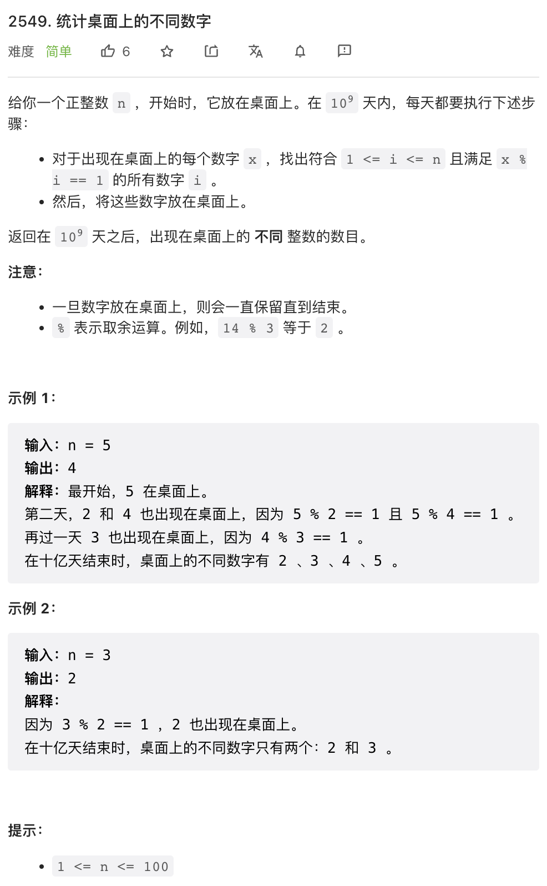
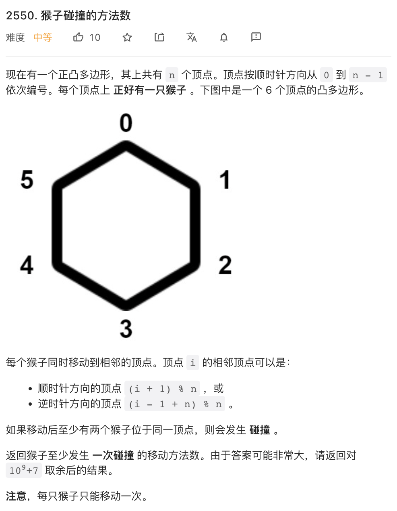
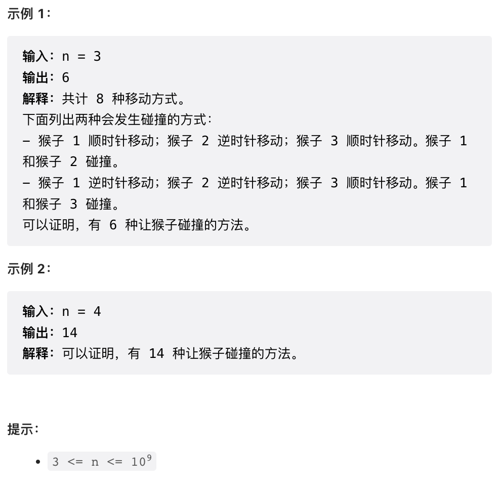
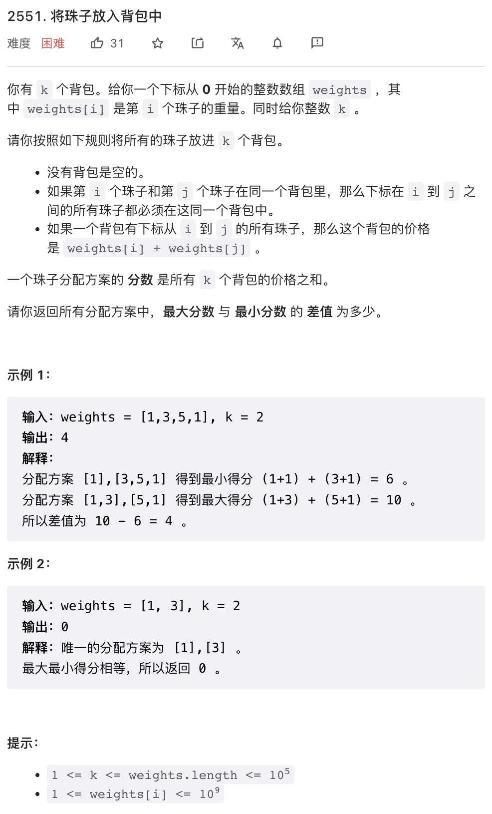
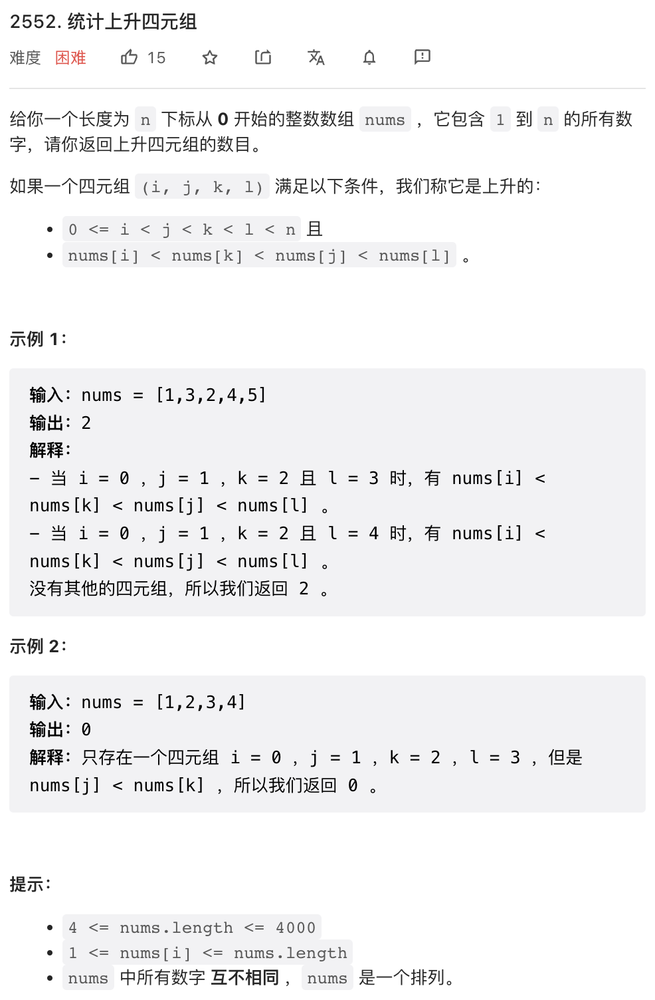

上周周赛非常有意思，但因为有事没有写题解，今天补上简单版。

## 1.



第一题就非常有意思，这个模拟操作虽然不会超时但太麻烦了。仔细想想，第一次一定会把 `n - 1` 放上去，第二次一定会把 `n - 2` 放上去，因此最终一定会把 `[2, n]` 都放上去。特例是 `n = 1` 此时第一轮把 `n` 放上去之后就结束了。因此在 `n = 1` 时结果是 1 其他情况结果是 `n - 1`.

```py
class Solution:
    def distinctIntegers(self, n: int) -> int:
        return max(n - 1, 1)
```

## 2.




这个题目有点脑筋急转弯：实际上，除了所有的猴子都往同一个方向运动之外的所有情况，都会碰撞。所以不会碰撞的情况总共只有 2 种。总方案有 `2^n` 种，python 的 `pow` 函数可以求 `2^n % m`.

```py
class Solution:
    def monkeyMove(self, n: int) -> int:
        m = 10 ** 9 + 7
        return (pow(2, n, m) - 2 + m) % m
```

## 3. 



这个题目看似有点像背包问题，但实际上跟动态规划完全没有关系：总的 cost 其实就是首尾两个元素和再加上选取 `n - 1` 个切分点的 cost. 而切分点可以先枚举所有切分点 cost, 然后做个排序就可以方便的取 MIN N OR MAX N 了。

```py
class Solution:
    def putMarbles(self, weights: List[int], k: int) -> int:
        sp = sorted(weights[i] + weights[i + 1] for i in range(len(weights) - 1))
        return sum(sp[-(k-1):]) - sum(sp[:k-1]) if k != 1 else 0
```

## 4. 



这是一道比较有新意的题目，而且很容易读错题目。它要求计数的不是顺序四个数，而是中间两个数颠倒。

这道题目很容易联想到逆序对，然后容易联想到本题解法跟逆序对是不是有关联，但这个思路走不通，本题跟逆序对没啥关联。

数据规模提醒我们，本题可能是复杂度接近 `O(n^2)` 解法。很容易有一个思路：枚举四个坐标中的两个，然后计数符合条件的数字。我尝试了枚举 `(i,j), (i,k), (i,l)` 最终发现枚举 `(j,k)` 比较可行。

基本思路是，枚举 `(j, k)` 然后立即就可以判断 `nums[j] > nums[k]` 是否满足。之后计数 `j` 前方小于 `nums[k]` 的数字个数，和 `k` 后方大于 `nums[j]` 的数字个数。这里我们使用了 Fenwick Tree 完成计数，也可以使用 DP 预计算这部分计数。

```cpp
struct Fenwick {
    vector<int> tree;
    int n;
    Fenwick(int size): n(size + 1), tree(size + 2, 0) {}
    void clear() {
        fill(tree.begin(), tree.end(), 0);
    }
    void add(int i, int x) {
        for(i++; i <= n; i += i & -i) tree[i] += x;
    }
    long long prefix(int i) {
        long long res = 0;
        for(i++; i > 0; i-= i & -i) res += tree[i];
        return res;
    }
};

class Solution {
public:
    long long countQuadruplets(vector<int>& nums) {
        long long res = 0;
        int n = nums.size();
        Fenwick pre(n), suf(n);
        for(int j = 1; j < n; j++) {
            pre.add(nums[j - 1], 1);
            suf.clear();
            for(int k = n - 2; k > j; k--) {
                suf.add(nums[k + 1], 1);
                if(nums[j] > nums[k]) {
                    res += pre.prefix(nums[k]) * (suf.prefix(n) - suf.prefix(nums[j]));
                }
            }
        }
        return res;
    }
};
```
