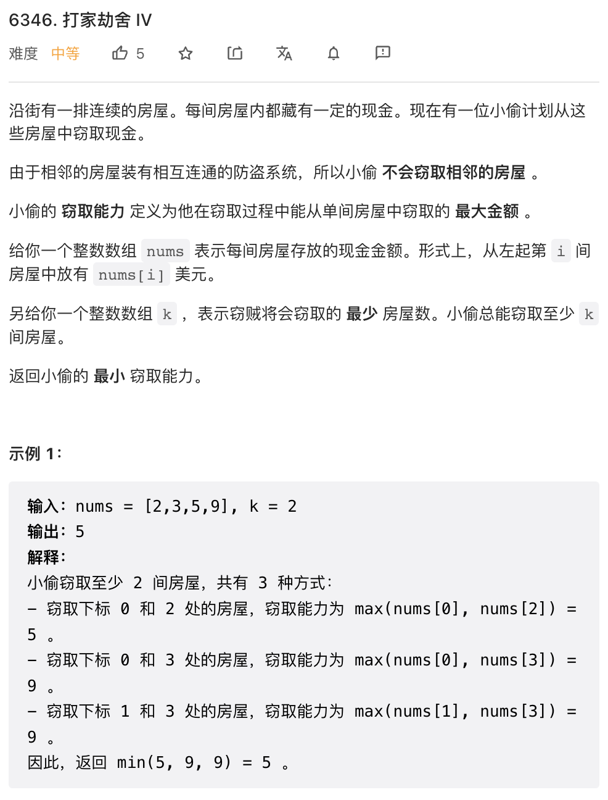

本周周赛中规中矩，没有什么非常特别的解法。

## 1.


这道题目作为第一题来说比较难了，利用优先队列，每一次拿出一个最大的数，然后把平方根按照要求放回去即可。

```cpp
class Solution {
public:
    long long pickGifts(vector<int>& gifts, int k) {
        long long total = accumulate(gifts.begin(), gifts.end(), 0LL);
        priority_queue<int> pq(gifts.begin(), gifts.end());
        while(k--) {
            int t = pq.top();
            pq.pop();
            int _t = sqrt(t);
            pq.push(_t);
            total -= t - _t;
        }
        return total;
    }
};
```

## 2.


可以预计算好哪些 word 是满足需求的。为了应付快速查询，可以计算一个前缀数组，保存前 `i` 个位置满足要求的 word 总数。

```py
class Solution:
    def vowelStrings(self, words: List[str], queries: List[List[int]]) -> List[int]:
        n = len(words)
        # 前缀数组，pre[i+1] 是前 i+1 个 word 中满足要求的总数
        pre = [0] * (n + 1)
        for i in range(n):
            # 类似于前缀和
            pre[i + 1] = pre[i]
            if words[i][0] in "aeiou" and words[i][-1] in "aeiou":
                pre[i + 1] += 1
        return [pre[p[1] + 1] - pre[p[0]] for p in queries]
```

## 3. 




这个问题可以二分法+贪心来求解。基本思路是，二分结果，也即二分的尝试某个 capability 是否可行。capability 给定之后，哪些房子可以取就可以确定了，只要能取的房子大于 k 即可。另一个要求是不能取近邻的房子。很容易验证，即使有这个限制条件，从左到右贪心的选取房子一定能取到最多的房子（也即只要 capability 满足并且前一个房子没有选取，就一定选取这个房子）。这样，我们只需要扫一遍就能确认某个 capability 下最多能取多少房子，然后就能确定这个 capability 是否可行。如此，借助二分法就能求得 min capability.

```py
class Solution {
public:
    int minCapability(vector<int>& nums, int k) {
        auto p = minmax_element(nums.begin(), nums.end());
        int left = *p.first, right = *p.second;
        while(left < right) {
            int mid = (left + right) / 2;
            bool last = false;
            int taken = 0;
            for(int x: nums) {
                if(x <= mid and not last) {
                    taken++;
                    last = true;
                } else {
                    last = false;
                }
            }
            if(taken >= k) {
                right = mid;
            } else {
                left = mid + 1;
            }
        }
        return left;
    }
};
```

## 4. 


这个问题并不是特别难，而且 LeetCode 前几周有一次双周赛有过一道思路类似的题目，大大降低了本题难度。

首先，我们是很容易验证能否另两个篮子相等的，只要两个篮子中所有元素能两两配对即可。也很容易求出每个篮子最终的目标 target，也即交换结束后篮子中的元素，这只要将所有元素均分到两个篮子中即可。

我们考察 basket1 （考察 basket2 结果是一样的），已知其最终 target 的情况下，我们可以很容易做个比对，求出 basket1 中需要换出去哪些元素，这些元素会换进来哪些元素（尽管我们是跟 target 比较的，但这些元素是从 basket2 中交换进来的）。很直观的方案是两两配对，这种方案下，总 cost 是需要交换的所有元素中最小的一半元素的和，因为我们总是可以用较小的一半元素去配对较大的一半元素。但实际上，如果用最小的元素做「跳板」，可能 cost 更小。更具体的，最小元素当然在两个篮子中都存在，我们可以将需要交换的两个元素分别与对方的最小元素交换，就能间接交换这两个元素了。

```py
class Solution:
    def minCost(self, basket1: List[int], basket2: List[int]) -> int:
        
        n = len(basket1)

        overall = sorted(basket1 + basket2)
        # 检查是否所有元素能够两两配对
        for i in range(n):
            if overall[i * 2] != overall[i * 2 + 1]:
                return -1
        
        # 两个篮子最终要达成的目标状态
        target = Counter(overall[i * 2] for i in range(n))
        # 篮子中的最小值
        minval = min(target)

        count1 = Counter(basket1)
        # 两个篮子中共同的元素：
        common = count1 & target
        # 两个篮子中需要交换的元素：
        diff1, diff2 = count1 - common, target - common
        # 这些元素两两配对需要的 cost:
        costs = sorted((diff1 + diff2).elements())
        costs = costs[:len(costs) // 2]
        # 最终 cost 是两两配对的 cost1 或者使用最小元素做跳板的 cost2 中较小的一个
        return sum(min(x, minval * 2) for x in costs)
```
