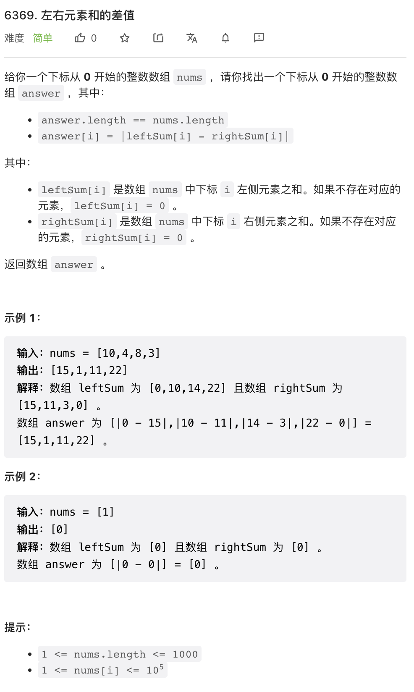
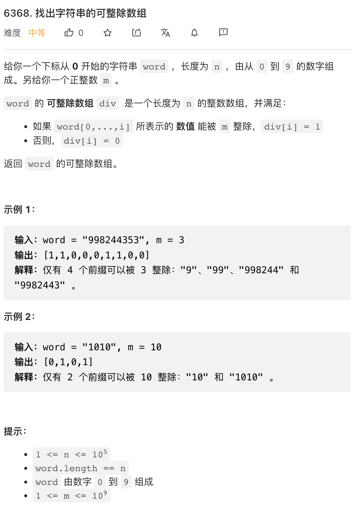
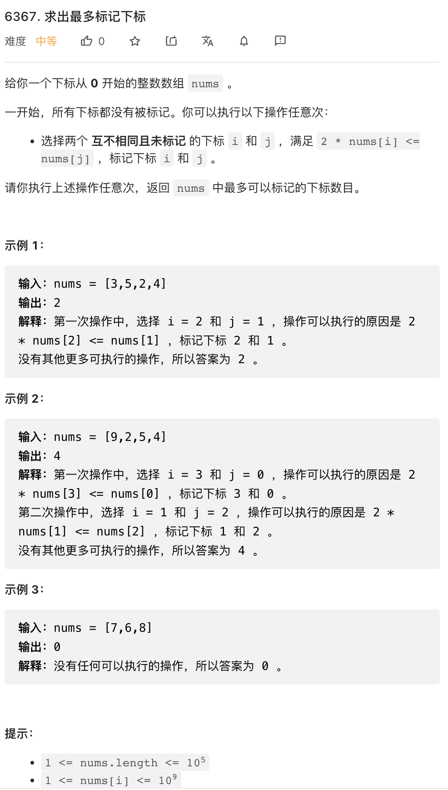
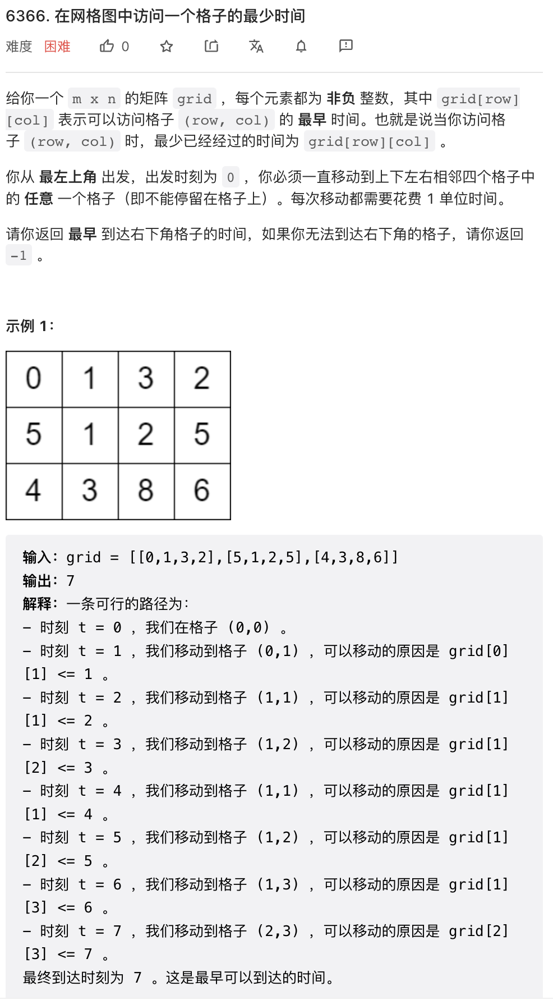
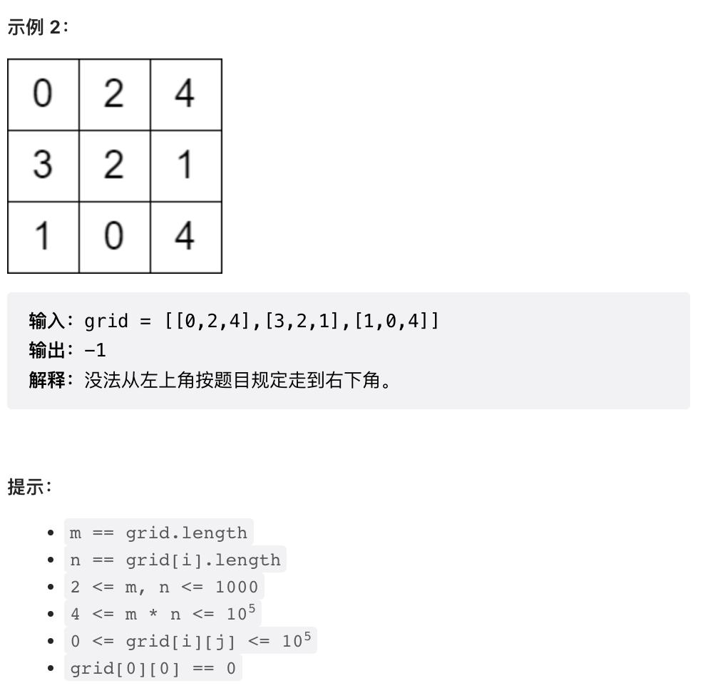

最近一段时间非常繁忙，周赛已经鸽了好几周了，再鸽下去这事怕是没了。本周周赛中规中矩。

## 1.



按照题目要求操作即可。生成一个前缀和，一个后缀和，然后做减法。

```py
class Solution:
    def leftRigthDifference(self, nums: List[int]) -> List[int]:
        n = len(nums)
        left, right = [0] * n, [0] * n
        for i in range(n - 1):
            left[i + 1] = nums[i] + left[i]
            right[-i - 2] = nums[-i - 1] + right[-i - 1]
        return [abs(x - y) for x, y in zip(left, right)]
```

## 2.



这个题目需要利用一个恒等式：`x * 10 % m = x % m * 10 % m`. 证明不难，注意等式右边 `x % m = x - k * m` 然后 `x % m * 10 % m = x * 10 % m - k * m * 10 % m` 第二项显然等于 0.

当然并不是之前学习过这个恒等式，而是这个题目与前缀和高度相似，所以怀疑可以使用前缀和相似的方法求解。

```py
class Solution:
    def divisibilityArray(self, word: str, m: int) -> List[int]:
        pre = 0
        res = []
        for c in word:
            pre = pre * 10 + int(c)
            pre %= m
            res.append(int(pre == 0))
        return res
```

## 3. 



这个题目主要是要想到是使用二分法（二分答案）求解。如果不使用二分法，很难找到一个配对策略。

借助二分法，我们只需要验证能否标记 n 对即可。不难想到，最佳标记策略就是尝试用最小的 n 个数和最大的 n 个数去配对，并且是按顺序配对。

温习一下，使用二分法的前提是，

- 问题的验证比求解容易，比如本问题，验证是否能够标记 n 对要比求解最大标记对数 N 容易
- 问题具有单调性，比如本问题，如果能够标记 n 对数字，则也一定能标记任意 x < n 对数字

```py
class Solution:
    def maxNumOfMarkedIndices(self, nums: List[int]) -> int:
        nums.sort()
        n = len(nums)
        left, right = 0, n // 2
        while left < right:
            mid = (left + right + 1) // 2
            if all(2 * nums[i] <= nums[-mid+i] for i in range(mid)):
                left = mid
            else:
                right = mid - 1
        return left * 2
```

## 4. 




这个问题是一个典型的图算法，与最段路问题高度相似。不同的是每个节点需要一定时间之后才能访问。

首先，不难发现一些事实：

- 只要出发之后可以移动一步，则可以一直在这两个节点之间反复移动消耗时间，直到所有节点都可以访问
- 因此，不能到达目的节点唯一的可能性是 `grid[0][1] > 1 and  grid[1][0] > 1`

考虑类似于 dijstra 算法的过程，如果在 d 时刻尝试访问某个节点，节点的访问时间限制是 x，则有以下三种情况：

- 如果 d >= x, 则可以访问，与一般的图最短路问题相同
- 如果 d < x, 则可以在到达该节点的路径上任意两个相邻位置「反复移动」消耗时间，直到可以访问为止，注意「反复移动」消耗的时间总是偶数，
  - 如果 `d % 2 == x % 2` 则一定可以在恰好 x 时刻访问这个节点，这也一定是访问这个节点的最优方案了
  - 如果 `d % 2 != x % 2` 则一定可以在 `x + 1` 时刻访问这个节点，注意到在这种格子中，由任意一条路径访问一个节点的时刻的奇偶一定是固定的，这也是最优方案了

由此，当我们知道访问某个节点的最优时刻之后，可以求解由该节点访问任何相邻节点的最优时刻。这样就相当于可以求解图上节点之间的距离了，于是这个问题就跟一般的图最段路问题没有区别了，可以使用 Dijkstra 算法求解了。注意以上论证是严格的，这里的算法是严格的 Dijkstra 算法，能保证时间复杂度是 `O(n log n)`.

```py
class Solution:
    def minimumTime(self, grid: List[List[int]]) -> int:
        
        if grid[1][0] > 1 and grid[0][1] > 1:
            return -1

        # shortest path, like dijstra
        m, n = len(grid), len(grid[0])
        dist = [[-1] * n for _ in range(m)]
        q = [(0, 0, 0)]
        
        while q:
            d, i, j = heappop(q)
            if dist[i][j] != -1 and dist[i][j] <= d:
                continue
            dist[i][j] = d
            
            t = d + 1
            for _i, _j in [(i - 1, j), (i + 1, j), (i, j - 1), (i, j + 1)]:
                if _i >= m or _j >= n or _i < 0 or _j < 0:
                    continue
                x = grid[_i][_j]
                _d = t if t >= x else x if t % 2 == x % 2 else x + 1
                heappush(q, (_d, _i, _j))
        
        return dist[m - 1][n - 1]
```
