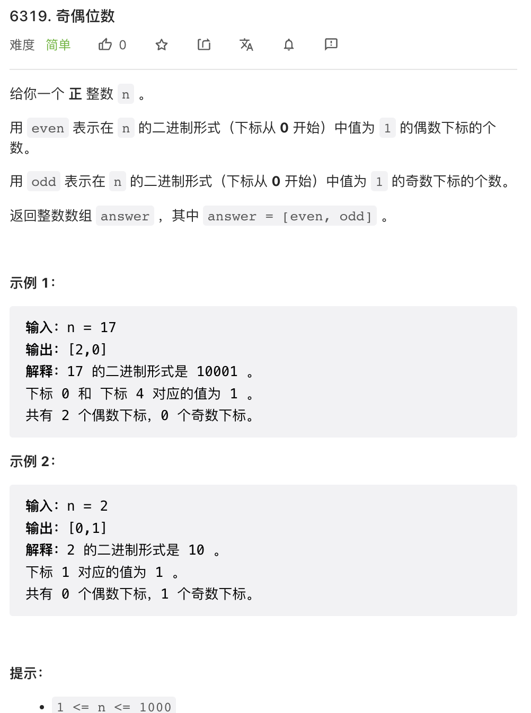
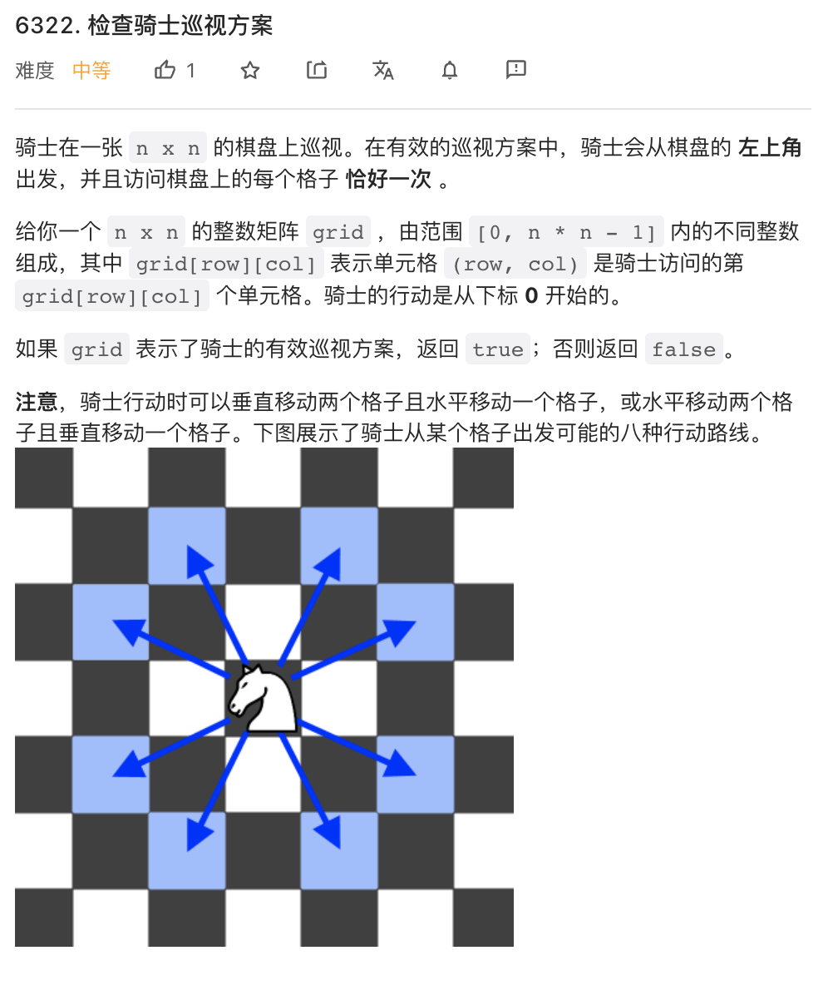
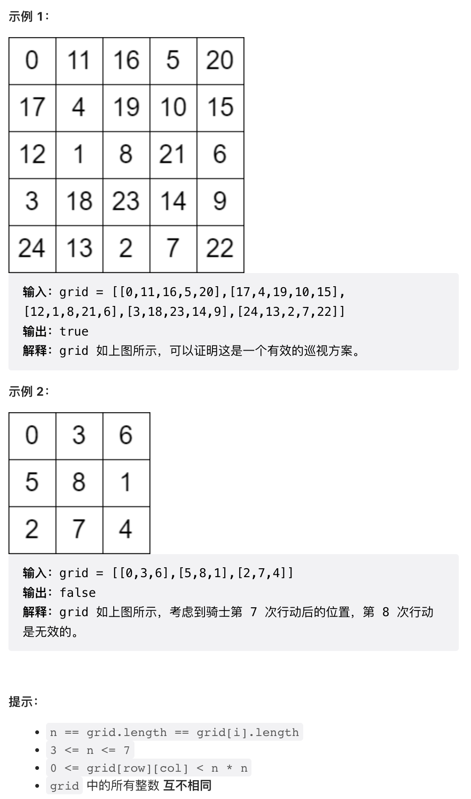
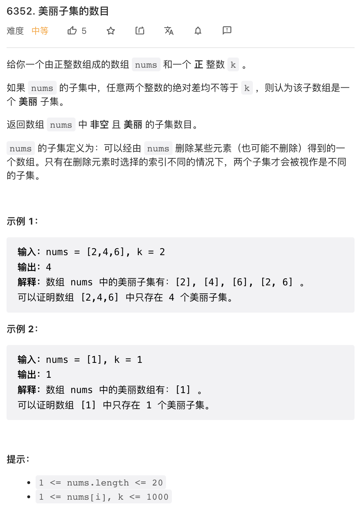
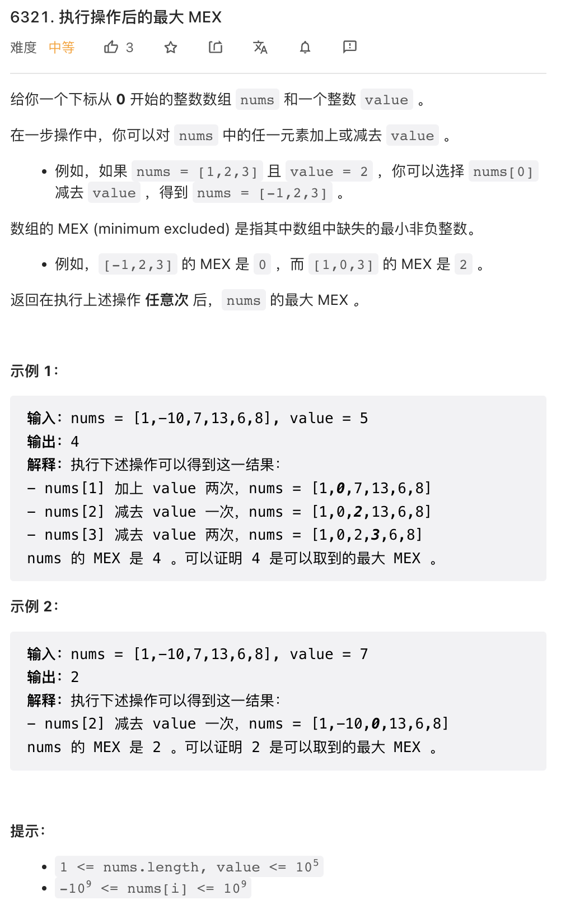

最近一段时间非常繁忙，周赛又已经鸽了好几周了。其实维护这个公众号本意还是以后发布更多有意思的东西，希望今年不要拖延症了。

本周第三题貌似比第四题还难。

## 1.



无甚可说，数数问题。这里使用位运算实现，可以用 Python 的 `bin` 函数转成字符串进行统计。

注意这个问题中是从右往左数比特位的，题目条件没有说的很清楚。

```cpp
class Solution {
public:
    vector<int> evenOddBit(int n) {
        int even = 0, odd = 0, i = 0, mask = 1;
        while(mask <= n) {
            if(mask & n) {
                if(i % 2) {
                    odd++;
                } else {
                    even++;
                }
            }
            i++;
            mask <<= 1;
        }
        return {even, odd};
    }
};
```

## 2.




基本思路是，从 0 号格子开始，按顺序逐个检查。每个格子跟上一个格子比较一下坐标差，从而判断是否是 Knight 可以到达的位置。

这个代码写的比较长是因为做了很多额外的检查。

```cpp
class Solution {
public:
    bool checkValidGrid(vector<vector<int>>& grid) {
        int n = grid.size();
        vector<tuple<int, int, int>> p(n * n);  // <grid_num, i_index, j_index>
        for(int i = 0; i < n; i++){
            for(int j = 0; j < n; j++) {
                p[i * n + j] = {grid[i][j], i, j};
            }
        }
        sort(p.begin(), p.end());
        for(int k = 0; k < n * n; k++) {
            int x, i, j;
            tie(x, i, j) = p[k];
            if(k == 0) {
                if(x != 0 or i != 0 or j != 0) return false;
            } else {
                int _x, _i, _j;
                tie(_x, _i, _j) = p[k - 1];
                if(_x + 1 != x) return false;
                int di = abs(_i - i), dj = abs(_j - j);
                if(not(di == 1 and dj == 2 or di == 2 and dj == 1)) return false;
            }
        }
        return true;
    }
};
```

## 3. 



这个问题直觉上是可以有多项式速度的解法的，但既然问题规模只有 20, 可以使用 bit mask 枚举所有子集，然后一一检查。但是这份代码过的比较悬，做了一些细节优化才不会 TLE.

```cpp
class Solution {
public:
    int beautifulSubsets(vector<int>& nums, int k) {
        const int v = *max_element(nums.begin(), nums.end()) + 1;
        const int n = nums.size();
        sort(nums.begin(), nums.end());
        
        vector<char> seen(v);
        int res = 0;
        unsigned mm = 1 << n;
        
        for(unsigned mask = 1; mask < mm; mask++) {
            bool succ = true;
            int i = 0;
            for(; i < n and succ; i++) {
                if(mask & (1 << i)) {
                    int x = nums[i];
                    seen[x] = true;
                    if(x - k > 0 and seen[x - k] or x + k < v and seen[x + k]) {
                        succ = false;
                    }
                }
            }
            for(; i >= 0; i--) {
                if(mask & (1 << i)) {
                    seen[nums[i]] = false;
                }
            }
            res += succ;
        }
        
        return res;
    }
};
```

## 4. 



这个题目我反而感觉比第三题要简单。题述操作实际上可以归结为一个数 `x` 可以替换为任意一个关于 `value` 同余的数 `y` 也即只要满足 `x % value = y % value` 即可。很容易想到，无论其他数字是什么，关于 `value` 同余的一组数最佳变换方案就是变换成从 `x % value` 开始间隔 `value` 的数列。

比如，`value = 5` 时，则所有 `x % value = 1` 的数字最佳变换方案就是 `1, 6, 11, ...`.

```cpp
class Solution {
public:
    int findSmallestInteger(vector<int>& nums, int value) {
        // 求 x % value, 注意处理负数
        const int n = nums.size();
        for(int i = 0; i < n; i++) {
            nums[i] = ((nums[i] % value) + value) % value;
        }
        // 排序之后同余的数都是相邻的
        sort(nums.begin(), nums.end());

        // 执行变换
        for(int i = 0; i < n; i++) {
            if(i != 0 and nums[i] % value == nums[i - 1] % value) {
                nums[i] = nums[i - 1] + value;
            }
        }

        // 排序之后寻找第一个缺失的非负整数
        sort(nums.begin(), nums.end());
        if(nums[0] != 0) return 0;
        for(int i = 1; i < n; i++) {
            if(nums[i] != nums[i - 1] + 1) {
                return nums[i - 1] + 1;
            }
        }
        return n;
    }
};
```
