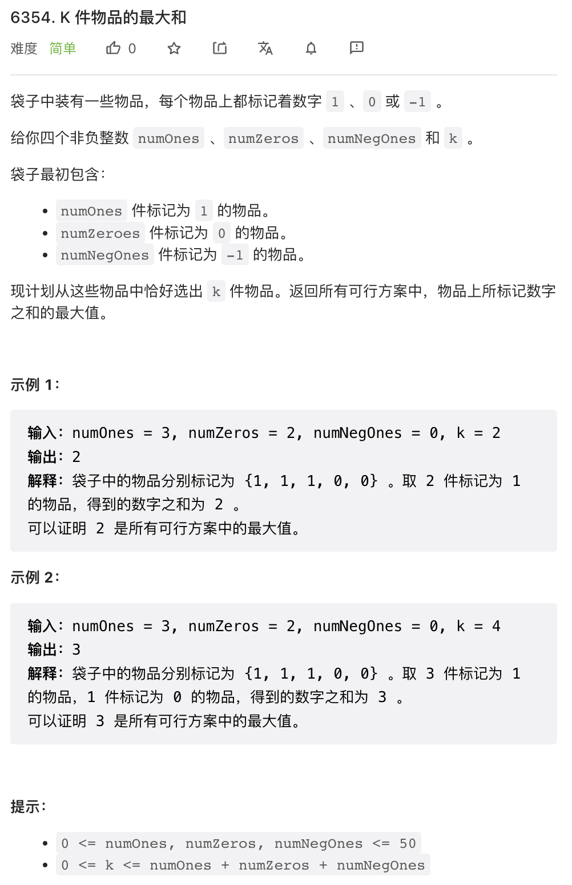
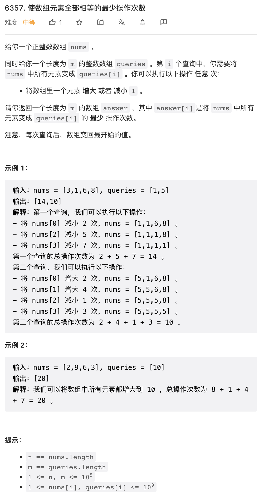
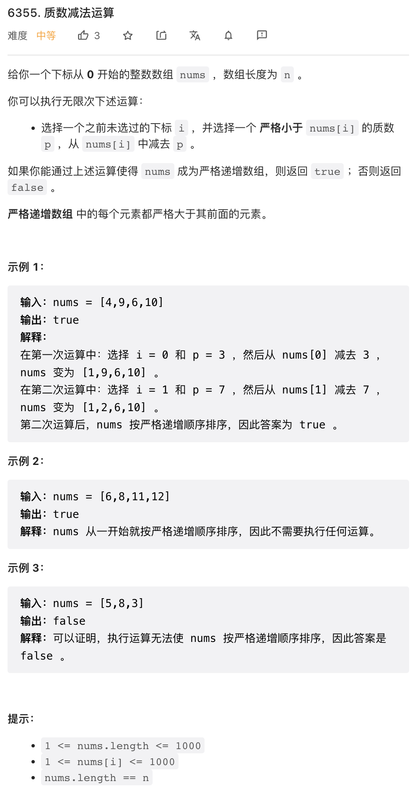
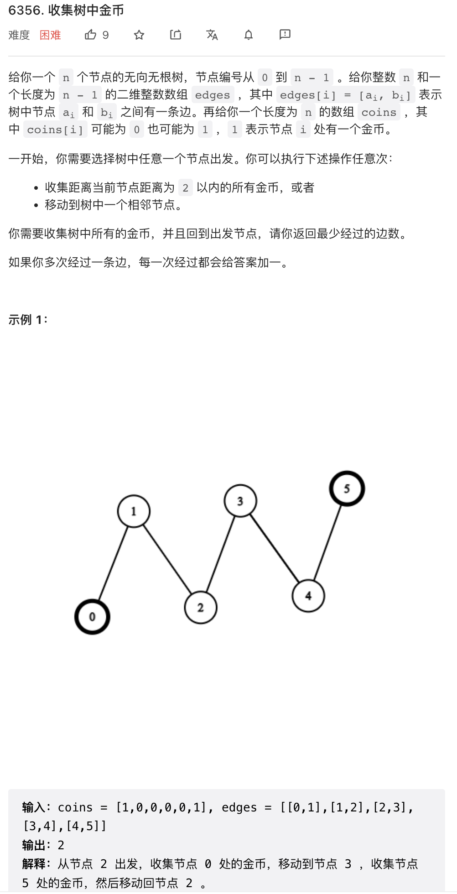
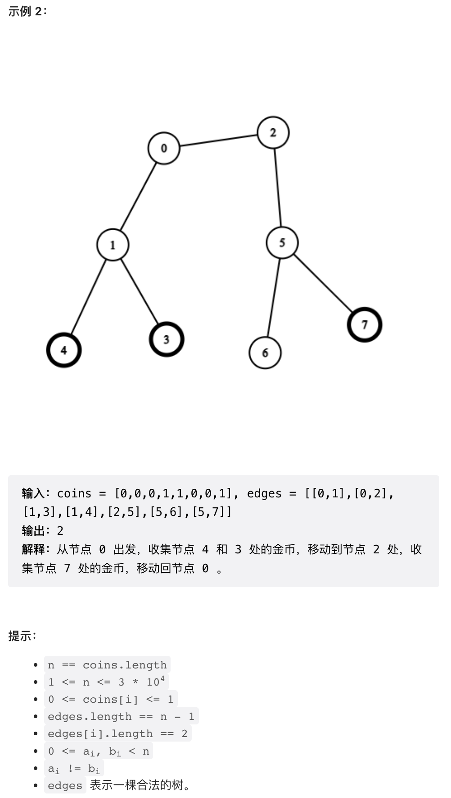

本周沉迷 ChatGPT, 周赛也没心情打了。整个活，使用 ChatGPT 打周赛效果如何？在我的协助下 ChatGPT 过掉了 2 题，在 22308 名选手中排名 3242，超越 85% 人类选手。程序员饭碗不保！

跟我走，与 AI 并肩作战，体会 AI 是如何思考的！

## 1.



这个题目比较适合 ChatGPT 因为题干简短，描述清晰。我将英文题干发给 ChatGPT-4,

```
write python code to solve this problem,

There is a bag that consists of items, each item has a number 1, 0, or -1 written on it.

You are given four non-negative integers numOnes, numZeros, numNegOnes, and k.

The bag initially contains:

numOnes items with 1s written on them.
numZeroes items with 0s written on them.
numNegOnes items with -1s written on them.

We want to pick exactly k items among the available items. Return the maximum possible sum of numbers written on the items.
```

令人震惊的是，ChatGPT 出色的解决了这个问题：

```py
# ChatGPT
class Solution:
    def kItemsWithMaximumSum(self, numOnes: int, numZeros: int, numNegOnes: int, k: int) -> int:
        total_items = numOnes + numZeros + numNegOnes

        # If the number of items to pick is more than the total items, return None
        if k > total_items:
            return None

        # Calculate the maximum possible sum
        max_sum = min(k, numOnes)  # Pick as many 1s as possible, up to k

        # Calculate remaining items to pick after choosing 1s
        remaining_k = k - max_sum

        # Pick as many 0s as possible (doesn't affect sum)
        remaining_k -= min(remaining_k, numZeros)

        # If there are still items to pick, pick -1s and update the sum
        if remaining_k > 0:
            max_sum -= remaining_k

        return max_sum
```

当然本题甚为简单，过掉并不惊讶。

我对 ChatGPT 不服，你看它啰哩啰嗦一大堆，我一行就行了。

```py
# Jiahao
class Solution:
    def kItemsWithMaximumSum(self, numOnes: int, numZeros: int, numNegOnes: int, k: int) -> int:
        return k if numOnes >= k else numOnes if numOnes + numZeros >= k else numOnes - (k - numOnes - numZeros)
```

## 3. 

我们跳过第二题，因为 AI 没做出来。先看第三题，



我们先来看看题目本身。为了理解 AI 的思路，读者至少要明白这道题目在做什么。

考虑对于某次 Query, 大于 Query 的数字集合为 A，小于 Query 的数字集合为 B 要求的操作次数就等于 `sum(A) - Query * len(A) + Query * len(B) - sum(B)`. 具体实现，这道题目最优解是双指针方法。可以在 `O(M+N)` 时间内求解。

我们可以先把数字和 Query 排序，然后使用双指针做一次遍历即可。

```py
class Solution:
    def minOperations(self, nums: List[int], queries: List[int]) -> List[int]:
        
        m, n= len(queries), len(nums)
        nums.sort()
        qs = sorted((x, i) for i, x in enumerate(queries))
        
        total = sum(nums)
        j = pre = 0
        res = [0] * m
        
        for x, i in qs:
            while j < n and nums[j] <= x:
                pre += nums[j]
                j += 1
            res[i] = (x * j - pre) + (total - pre - x * (n - j))

        return res
```

除了双指针之外，二分法也是可以解决问题的。二分法基本思路是，也先把 `nums` 排序，然后对每个 Query 利用二分法找到大于 Query 的所有数字和小于 Query 的所有数字，然后分别求和就可以了。可以使用前缀和加速求和过程。

同样的，我们把题目发给 ChatGPT,

```py
# ChatGPT
class Solution:
    def minOperations(self, nums: List[int], queries: List[int]) -> List[int]:
        answer = []
        total_sum = sum(nums)
        n = len(nums)

        for query in queries:
            diff_sum = 0
            for num in nums:
                diff_sum += abs(num - query)
            answer.append(diff_sum)
        return answer
```

ChatGPT 出色的回答了这个问题，它的这份代码逻辑是对的！但是会超时。我并没有把数据规模发给它，超时可以理解。我发出指令 `you get TLE. make the code faster`. ChatGPT 的表现非常令人惊讶，它正确理解了我的意思，然后试图使用二分搜索加速。

```py
# Jiahao: you get TLE. make the code faster
# ChatGPT

class Solution:
    def minOperations(self, nums: List[int], queries: List[int]) -> List[int]:
        answer = []
        nums.sort()

        def binary_search(nums, target):
            left, right = 0, len(nums) - 1
            while left <= right:
                mid = left + (right - left) // 2
                if nums[mid] == target:
                    return mid
                elif nums[mid] < target:
                    left = mid + 1
                else:
                    right = mid - 1
            return left

        def calc_operations(nums, idx, target):
            operations = 0
            for i in range(len(nums)):
                operations += abs(nums[i] - target)
            return operations

        for query in queries:
            idx = binary_search(nums, query)
            operations = calc_operations(nums, idx, query)
            answer.append(operations)

        return answer
```

它这个代码写的头头是道，甚至把我都糊弄过去了，我觉得应该能过，但实际上仍然是个 TLE. 我以为是 Python 太慢了，命令 ChatGPT 用 C++ 重写这段代码（ChatGPT 能够有效进行代码片段的翻译，我在实战中常常使用），仍然 TLE. 我提示它使用双指针，但它错的更离谱了。

我仔细看了一遍它的代码，发现它写了个二分搜索其实是装样子的，压根没用上，它那个二分搜索返回变量 `idx` 没有使用。我决定再试一下。我指出，`go back to the binary search python version. you didn't use the binary search result idx`. 令人感动，它听懂了，

```py
def calc_operations(nums, idx, target):
    operations = 0
    for i in range(idx):
        operations += abs(nums[i] - target)
    for i in range(idx, len(nums)):
        operations += abs(nums[i] - target)
    return operations
```

这个代码就看到曙光了，它只要能分别处理 idx 两侧的求和就行了，我指出，`you need to fast up the calculation of operators in the two side of idx, you cannot add them one by one. it's too slow`. 它正确理解了我的意思。但它没有使用前缀和进行优化，而是调用了 python 的 sum 函数。我直接给出提示，`use a pre-calculated prefix sum array instead of sum function`. 它又非常惊艳的正确进行了前缀和计算，并几乎正确的替换了 sum 函数，但不知为啥它把 target 搞丢了，

```py
def calc_operations(nums, idx, target):
    operations = 0
    operations += nums[idx - 1] * idx - prefix_sum[idx] if idx > 0 else 0
    operations += prefix_sum[-1] - prefix_sum[idx] - nums[idx] * (len(nums) - idx) if idx < len(nums) else 0
    return operations
```

我提示 `you didn't use variable target in the calc_operations function, you need to use it`. 提示之后，它成功解决了这个问题，

```py
def min_operations(nums, queries):
    answer = []
    nums.sort()
    prefix_sum = [0] * (len(nums) + 1)
    
    for i in range(len(nums)):
        prefix_sum[i + 1] = prefix_sum[i] + nums[i]

    def binary_search(nums, target):
        left, right = 0, len(nums) - 1
        while left <= right:
            mid = left + (right - left) // 2
            if nums[mid] == target:
                return mid
            elif nums[mid] < target:
                left = mid + 1
            else:
                right = mid - 1
        return left

    def calc_operations(nums, idx, target):
        operations = 0
        operations += target * idx - prefix_sum[idx] if idx > 0 else 0
        operations += prefix_sum[-1] - prefix_sum[idx] - target * (len(nums) - idx) if idx < len(nums) else 0
        return operations

    for query in queries:
        idx = binary_search(nums, query)
        operations = calc_operations(nums, idx, query)
        answer.append(operations)

    return answer
```

这份代码正确，可以通过！

这一题的求解过程令人印象深刻。ChatGPT 其实真的很像人，它「想到」要用二分搜索，但没有用对，在提示下，它一点点改正，最终成功解决问题。


## 结论：准备下岗！

总体来说，ChatGPT 的表现非常令我惊讶，它在指导之下解决了两道问题，超越（严格来说，大于等于） 85% 人类选手（不过，今天 LeetCode 服务器挂了几十分钟，所以人类选手表现受到一些影响），特别是求解第三题的过程，那种感觉太像以前我做老师给学生讲题了。或许角色很快就会翻转，我们要做被指导的学生了。

我曾经专门分析过解题的思维过程。我自己的体会是，求解一个数学或者物理或者编程题目的过程可以分为两步，首先「寻求思路」，就像第三题中，二分法、双指针，这些就是「思路」。然后，需要严密的将灵感转换成逻辑步骤，最终构成题解。与 ChatGPT 合作的过程，我感觉它的第一步已经做的有模有样了，换句话说，创新性的一步它反而做得好。第二步严密的逻辑验证，它做的还不是那么好，但也已经非常棒了。

最可怕的是，我觉得这是以很高的标准在要求它。网测对人类选手也很难，因为计算机评分，难以糊弄了事。其他非计算机打分的考试中，特别明显的是证明题，其实人类选手也常常是胡说八道。计算题中，人类选手也常常是能套的上的东西就往上搬，而 ChatGPT 也是这么干的。

我个人怀疑，尽管现在 AI 还没有解决「严密推理」这个难题，但这个问题很可能比「理解自然语言」本身要简单，而一旦 AI 将严密推理能力和自然语言理解能力结合起来，我就饭碗不保了。

结论，完了，准备下岗送快递、送外卖，听从 AI 指挥！

---

下面是 AI 没写出来的两道问题，有兴趣的同学可以看一看！

## 2.



这个题目就得动点脑筋了。本题可以贪心的求解。考虑从左到右处理 `nums`, 则每个数在保证大于其左侧的数的前提下，应该尽可能地小（也即尽可能减去一个比较大的质数）。

至于质数列表，可以使用素数筛算法预计算。素数筛是一个速度非常接近 `O(n)` 的快速算法。我给出的解法：

```cpp
// 素数筛模板，不难理解
void prime_flags(std::vector<bool>& flags) {
    int lim = int(flags.size());
    flags[0] = flags[1] = false;
    for (int n = 4; n < lim; n += 2) {
        flags[n] = false;
    }
    for (int n = 3; n * n <= lim; n += 2) {
        if (flags[n]) {
            for (int t = n * 3; t < lim; t += n << 1) {
                flags[t] = false;
            }
        }
    }
}

class Solution {
public:
    bool primeSubOperation(vector<int>& nums) {
        // 使用素数筛算法生成 1000 以内的素数列表
        const int x = 1024;
        vector<bool> flags(x, true);
        prime_flags(flags);
        vector<int> ps = {0};
        for(int i = 0; i < x; i++) {
            if(flags[i]) {
                ps.push_back(i);
            }
        }

        const int n = nums.size(), m = ps.size();
        for(int i = 0; i < n; i++) {
            bool succ = false;
            for(int j = m - 1; j >= 0 and not succ; j--) {
                // 从大到小检查所有素数，寻找能够维持递增条件的最大的素数作为减数
                // 这里也可以使用二分法，但因为 1000 以内的素数不太多，没必要
                if(ps[j] < nums[i] and (i == 0 or nums[i] - ps[j] > nums[i - 1])) {
                    nums[i] -= ps[j];
                    succ = true;
                }
            }
            if(not succ) {
                return false;
            }
        }
        return true;
    }
};
```

同样的，我将本题英文题干发给 ChatGPT, 它给出解法如下，

```py
# ChatGPT

def is_prime(n: int) -> bool:
    if n <= 1:
        return False
    for i in range(2, int(n**0.5) + 1):
        if n % i == 0:
            return False
    return True

def find_largest_prime_less_than(n: int) -> int:
    for i in range(n - 1, 1, -1):
        if is_prime(i):
            return i
    return None


class Solution:
    def primeSubOperation(self, nums: List[int]) -> bool:
        for i in range(len(nums) - 1):
            largest_prime = find_largest_prime_less_than(nums[i])
            if nums[i] - largest_prime < nums[i + 1]:
                nums[i] -= largest_prime
            else:
                return False
        return True
```

它这个写的其实有点那个意思，但在处理 `nums[i]` 时，它只保证了 `nums[i]` 小于后一个数，没有检查 `nums[i]` 是否大于前一个数。相当于它只向右做了检查，没有向左做检查。我试图给它指出错误，发出指令 `you didn't check if nums[i] larger than nums[i - 1]`. 它至少挺明白了我指示的是什么位置，但显然它无法理解深层的错误，它改的更离谱了。这个题目到此为止。

```py
class Solution:
    def primeSubOperation(self, nums: List[int]) -> bool:
        for i in range(1, len(nums)):
            if nums[i] <= nums[i - 1]:
                largest_prime = find_largest_prime_less_than(nums[i])
                if nums[i] - largest_prime > nums[i - 1]:
                    nums[i] -= largest_prime
                else:
                    return False
        return True
```

## 4. 




这个问题作为周赛问题，比较复杂。ChatGPT 就不提了，人类选手大部分也是做不出来这道题目的。

求解这个问题，首先需要明白，最终需要遍历的节点是整个树的一个子树。然后需要证明，要便利一个子树并在便利之后回到初始节点，则无论从这棵子树上任何节点出发，需要走的步数都是相通的，而且这个步数等于子树节点数量 `(n - 1) * 2`. 这个结论不难证明。

这样一来，问题主要难点就是求这棵需要遍历的子树。

在这棵无根树上，我们仍然可以定义叶节点，叶节点就是只跟一个节点相连的结蒂娜。我们可以运行拓扑排序的算法，就是从树的所有叶节点开始删除，删除掉叶节点之后再删除成为叶节点的节点，直到删除整棵树。首先，我们可以把没有硬币的所有叶节点删除掉，这些叶节点一定不会被访问，它们对问题没有影响。然后递归的删除所有按拓扑排序子节点中没有硬币的节点。

然后，剩下的一棵树所有的节点都需要到达，或者到达距离其小于 2 的节点，从而保证这些节点上的硬币被收集。我们可以再运行一遍上述拓扑排序过程，并统计所有高度超过 2 的节点数量，这些节点就是必须要遍历的节点。

这段代码虽然比较长，但实际上拓扑排序重复了两遍，并不十分复杂。

```cpp
class Solution {
public:
    int collectTheCoins(vector<int>& coins, vector<vector<int>>& edges) {
        const int collect_dist = 2;
        
        // 建图，并统计节点度数
        int n = coins.size();
        vector<vector<int>> g(n);
        vector<int> degree(n);
        for(auto& e: edges) {
            int a = e[0], b = e[1];
            g[a].push_back(b);
            g[b].push_back(a);
            degree[a]++;
            degree[b]++;
        }
        
        // 删掉所有没有硬币的子节点，以及整棵子树都没有硬币的节点
        // 可以递归的证明，这一步删除之后，剩下的节点都需要收集
        // 通过更新 degree 数组来标记哪些节点被删除了
        queue<int> q;
        for(int i = 0; i < n; i++) {
            if(degree[i] == 1 and coins[i] == 0) q.push(i);
        }
        while(q.size()) {
            int i = q.front();
            q.pop();
            if(!degree[i]) continue;
            degree[i] -= 1;
            for(int p: g[i]) {
                if(!degree[p]) continue;
                degree[p] -= 1;
                if(degree[p] == 1 and coins[p] == 0) q.push(p);
            }
        }
        
        // 删除剩下的节点，并统计高度大于 2 的节点个数
        // 此时可以保证所有的节点都需要收集，因此不需要检查是否有 coin 了
        for(int i = 0; i < n; i++) {
            if(degree[i] == 1) q.push(i);
        }
        vector<int> height(n);
        int res = 0;
        while(q.size()) {
            int i = q.front();
            q.pop();
            if(!degree[i]) continue;
            degree[i] -= 1;
            for(int p: g[i]) {
                if(!degree[p]) continue;
                degree[p] -= 1;
                height[p] = max(height[p], height[i] + 1);
                if(degree[p] == 1) q.push(p);
            }
            res += int(height[i] >= 2) * 2;
        }
        return res;
    }
};
```

我还是试了一下 ChatGPT, 它写了个 DFS 树遍历，我完全看不懂它在干啥反正它不是在做这道题目。我的指导无从下手，放弃。

```py
# ChatGPT
class Solution:
    def collectTheCoins(self, coins: List[int], edges: List[List[int]]) -> int:
        from collections import defaultdict
        def dfs(node, parent):
            nonlocal res

            cur_coins = coins[node]
            max_edge_dist = 0
            second_max_edge_dist = 0

            for neighbor in tree[node]:
                if neighbor != parent:
                    dist, collected = dfs(neighbor, node)
                    cur_coins += collected

                    edge_dist = dist + 1
                    if edge_dist > max_edge_dist:
                        second_max_edge_dist = max_edge_dist
                        max_edge_dist = edge_dist
                    elif edge_dist > second_max_edge_dist:
                        second_max_edge_dist = edge_dist

            if cur_coins > 0:
                res += 2 * (max_edge_dist + second_max_edge_dist)

            return max_edge_dist, cur_coins

        tree = defaultdict(list)
        for a, b in edges:
            tree[a].append(b)
            tree[b].append(a)

        res = 0
        dfs(0, -1)
        return res
```
