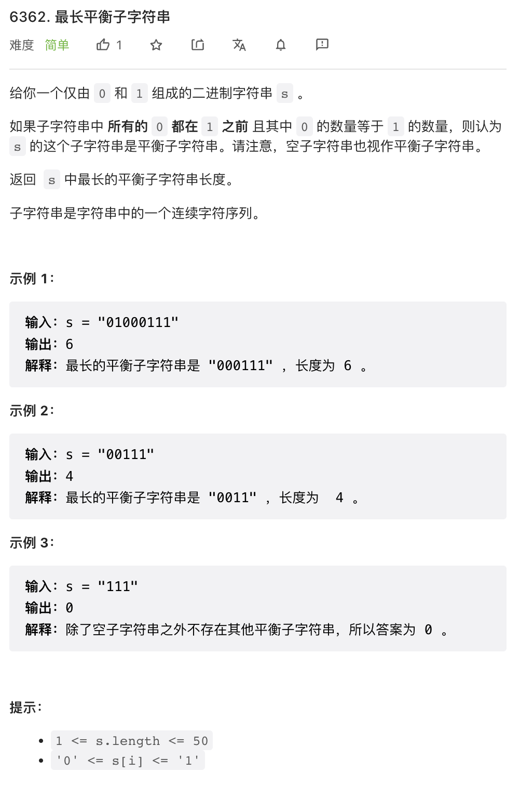
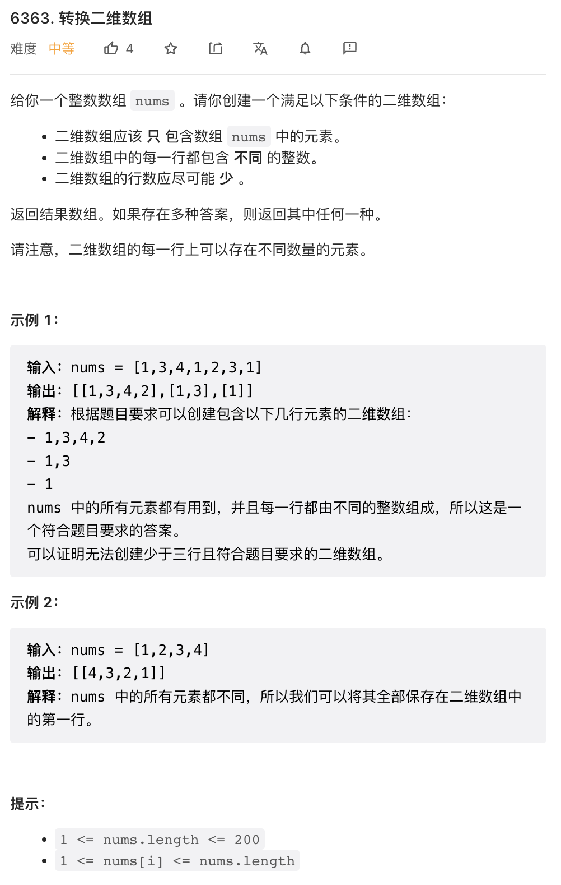
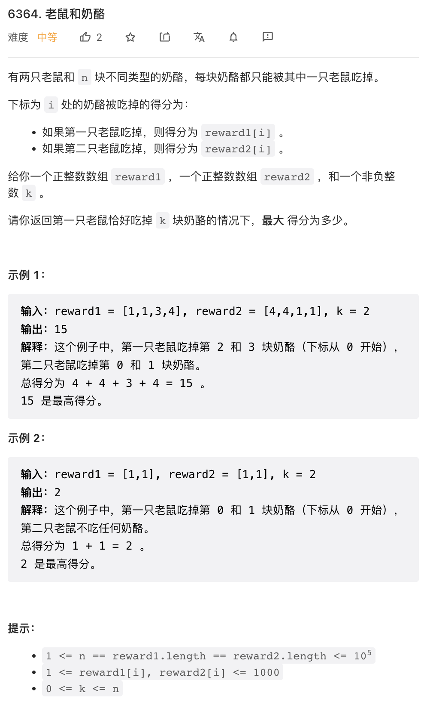
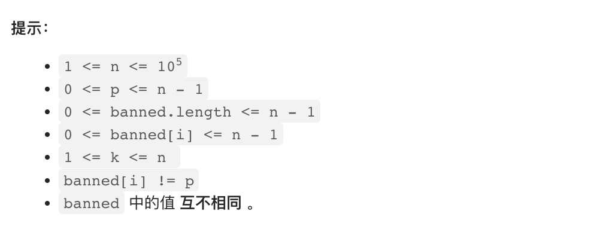

本周没工夫让 ChatGPT 捣乱了，还是我自己上吧。最后一道题目很有新意，值得一看。

## 1.



无甚可说，从长到短构造目标字符串并搜索即可。

```py
class Solution:
    def findTheLongestBalancedSubstring(self, s: str) -> int:
        n = len(s)
        for half in range(n // 2, 0, -1):
            if '0' * half + '1' * half in s:
                return half * 2
        return 0
```

## 2.



这个题目其实就是把重复的数字分到不同的 list 里就可以了。由于这题目数据规模非常小，我写了一个很慢的解，我这个代码最坏时间复杂度是 `O(n^2)`. 其实可以很容易的优化到 `O(n)` 但这里不再赘述了。

```py
class Solution:
    def findMatrix(self, nums: List[int]) -> List[List[int]]:
        nums.sort()
        res = []
        for x in nums:
            succ = False
            for r in res:
                if not r or x != r[-1]:
                    r.append(x)
                    succ = True
                    break
            if not succ:
                res.append([x])
        return res
```

## 3. 



这题目似乎比第二题还简单一点，主要是每块奶酪是可以单独决策的，因此贪心法即可解决问题。定义第一只老鼠得分减去第二只老鼠得分为分差，第一只老鼠应该吃掉分差最大的 k 个奶酪。

使用 Python 可以两行求解。

```py
class Solution:
    def miceAndCheese(self, reward1: List[int], reward2: List[int], k: int) -> int:
        diff = sorted((y - x, x, y) for x, y in zip(reward1, reward2))
        return sum(t[1] for t in diff[:k]) + sum(t[2] for t in diff[k:])
```

## 4. 




这道题目是有点意思的。我们不难理解，这其实是一道图算法问题。每个位置可以通过恰当的选择反转区间与交换到一些其他位置，则这些位置可以认为是在图上近邻的。

所以这是一个无负权重的图上单源最短路问题，最著名的解法是 Dijkstra 算法。本题是一种简化情况，所有边的长度都是 1，可以把 Dijkstra 算法退化成 BFS，也即使用队列取代 Dijkstra 算法中的优先队列。

但本题的难度在于，这个图的规模太大了。图上有 10^5 级别的节点，每个节点可以有 `O(n)` 级别的近邻，所以会有 `O(n^2)` 级别的边，直接使用 BFS 则只要把所有的边都搜索一遍就超时了。无论是 BFS 还是 Dijkstra, 其实每个节点入队一次就可以了。问题在于，每个节点会有 `O(n)` 级别的近邻节点，如果逐个去检查这些节点是否曾经入队，就会超时。需要有某种方案快速确定所有近邻节点中有哪些不曾入队。

我们很容易想到，给定一个节点，它的近邻节点应该类似一个连续区间，准确点说，是一个间隔为 2 的连续区间，然后当然要扣除 `banned` 中的点。BFS 过程中，要把这个间隔 2 连续区间扫描一遍，把没有入队的节点入队。于是，一个比较自然的想法是，把所有的未访问节点放入一个二叉搜索树（C++ 中的 Set, 支持查找和增删节点的有序数据结构），每次入队之后就把这个节点从二叉搜索树中删掉。这样就能避免重复查找。

有一个细节，由于我们需要以步长为 2 迭代，所以我们需要把奇数和偶数节点分别放到一个二叉搜索树中，于是共需要两个二叉搜索树。

这个算法每个节点需要加入一次二叉搜索树，所以时间复杂度是 `O(n log n)`.

```cpp
class Solution {
public:
    vector<int> minReverseOperations(int n, int p, vector<int>& banned, int k) {
        // 所有可以访问的节点加入二叉搜索树
        unordered_set<int> ban(banned.begin(), banned.end());
        set<int> pos[2];
        for(int i = 0; i < n; i++) {
            if(!ban.count(i) and i != p) {
                pos[i & 1].insert(i);
            }
        }

        // BFS
        vector<int> res(n, -1);        
        queue<pair<int, int>> pq;
        pq.push({0, p});
        res[p] = 0;
        
        while(pq.size()) {
            auto p = pq.front();
            pq.pop();
            int dist = p.first, node = p.second;
            // left 和 right 是不考虑 ban 前提下从 node 出发能到达的最左和最右位置
            // 注意考虑边界情况，不难推导出这里的结果（可以先推导最左最右 reverse 区间的位置，然后推导可以到达的极限位置）
            int left =  max(k - 1 - node, node - k + 1);
            int right = min(2 * n - 1 - k - node, node + k - 1);
            // 当 k 是奇数时，从任意节点出发总是只能到达奇偶性相同的节点
            // 当 k 是偶数时相反，只能到达与当前节点奇偶不同的节点
            int flag = k % 2 ? node & 1 : 1 - node & 1;
            // 迭代二叉搜索树中满足搜索范围的节点
            auto begin = pos[flag].lower_bound(left), end = pos[flag].upper_bound(right);
            for(auto it = begin; it != end; it++) {
                res[*it] = dist + 1;
                pq.push({dist + 1, *it});
            }
            pos[flag].erase(begin, end);
        }
        
        return res;
    }
};
```

但这并不是一个很漂亮的解法，主要是二叉搜索树比较慢，而且并不是所有语言标准库中都提供这种有序数据结构，我所了解的只有 C++ 的 set 和  Java 的 TreeMap.

我在评论区看到了一种更加漂亮的解法，使用并查集取代二叉搜索树。其思想是，实现了一种特殊的并查集，总是返回集合中最大端点，这样，对于已经访问过的节点，可以将其与 `node+2` 合并，起到类似于链表指向 `n+2` 的效果，这样也能快速跳过已经访问过的节点，而且速度更快、逻辑更简单，

```cpp
struct MergeFindSet {
    vector<int> p;
    MergeFindSet(int size): p(size) {
        for(int i = 0; i < size; i++) {
            p[i] = i;
        }
    }
    int find(int x) {
        return p[x] = p[x] == x ? x : find(p[x]);
    }
    void merge(int x, int y) {
        int px = find(x), py = find(y);
        tie(px, py) = minmax(px, py);
        p[px] = py;
    }
};
class Solution {
public:
    vector<int> minReverseOperations(int n, int p, vector<int>& banned, int k) {
        MergeFindSet mfs(n + 2);
        mfs.merge(p, p + 2);
        for(int x: banned) {
            mfs.merge(x, x + 2);
        }
        
        vector<int> res(n, -1);        
        queue<int> pq;
        pq.push(p);
        res[p] = 0;
        mfs.merge(p, p + 2);
        
        while(pq.size()) {
            int node = pq.front();
            pq.pop();
            int left =  max(k - 1 - node, node - k + 1), right = min(2 * n - 1 - k - node, node + k - 1);
            
            for(auto it = mfs.find(left); it <= right; it = mfs.find(it)) {
                res[it] = res[node] + 1;
                pq.push(it);
                mfs.merge(it, it + 2);
            }
        }
        
        return res;
    }
};
```