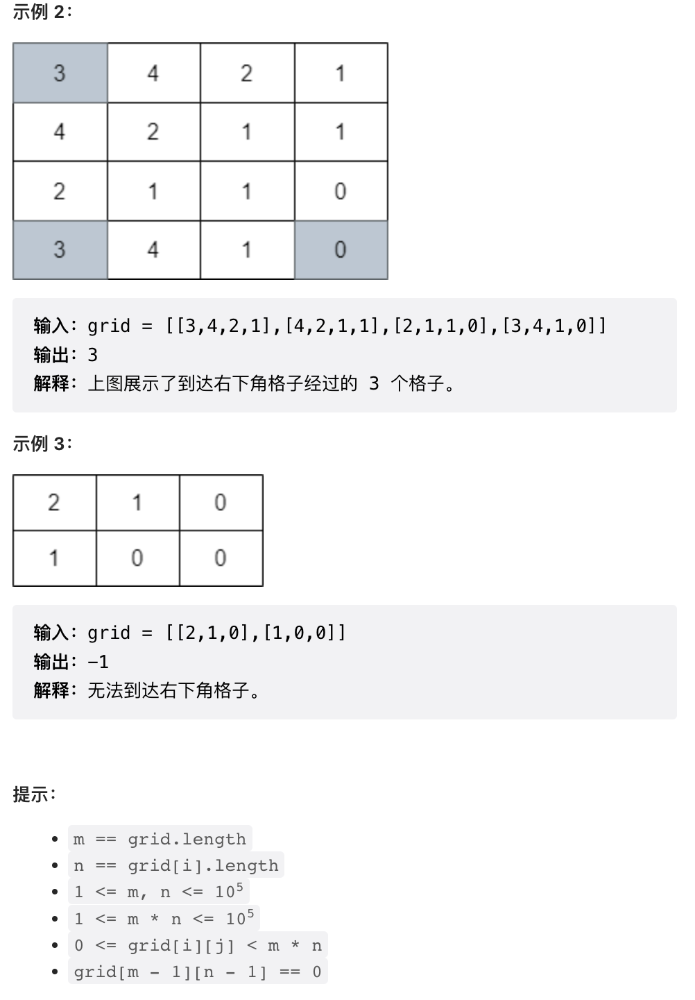

并查集是大二时候学的，没想到还能 Get 新使用姿势。本周新活，讲一下使用并查集模拟数组中元素的删除，特定情境下可以代替链表或二叉搜索树！附带 JavaScript 风味的前三题。

## 「难以删除」

我们先来考虑一个抽象的问题：给定一个数组 `A`，要求实现两种操作：

1. 查询 `A` 中大于等于某个给定值 `x` 的最小元素
2. 删除 `A` 中大于等于某个给定值 `x` 的最小元素

想要使用简单数据结构实现这两种操作是很困难的。第一个操作很简单，只需要把 `A` 预先排序，然后二分搜索即可以 `O(log N)` 的速度实现查询。但如果将 `A` 放置在一个数组中，就不能方便的实现删除操作，数组元素的删除操作时间复杂度是 `O(N)`, 效率低下。

一般来说，能够实现这两种操作的数据结构是二叉搜索树，C++ 中的 `set` 或者 `map` 以及 Java 中的 `TreeMap` 一般就采用二叉搜索树（如红黑树）实现，能够以 `O(log N)` 速度实现查询和删除操作。但二叉搜索树有一些问题，

1. 尽管这两种容器时间复杂度名义上是 `O(log N)`, 但实际上是比较慢的，因为二叉树是一种较为复杂的数据结构，还存在动态内存申请
2. 并不是所有的语言都有内置的二叉搜索树实现，以及，由于过于复杂，想要自行实现这类数据结构是非常困难的

这个需求中的痛点就在于删除。数组中尽管不能高效的实现删除，但有种折中办法，标记删除，也被形象的称之为「墓碑」。就是不实际删除某个元素，而是做一个删除标记（墓碑）。但如果数组中大量的元素都被删除，留下来了大量墓碑，就会影响查找效率。想象一个大部分元素都是墓碑的数组，如果我们想要查找某个大于等于某个值的最小元素，运行二分法查找到满足要求的元素后，如果这个元素不幸是个墓碑，就得向后逐个检索，寻找第一个不是墓碑的元素，这个操作最坏就会导致时间复杂度变成 `O(N)`.

```cpp
// 例子

// 一个有序数组初始状态，
[0, 1, 2, 3, 4, 5, 6, 7, 8, 9]

// 标记删除 3, 4, 6, 7
[0, 1, 2, x, x, 5, x, x, 8, 9]

// 此时查询大于等于 3 的第一个元素，会查询到一个墓碑
[0, 1, 2, x, x, 5, x, x, 8, 9]
          ^

// 之后需要后移两次，才能找到第一个有效的元素 5
[0, 1, 2, x, x, 5, x, x, 8, 9]
          -> -> ^
```

## 最大元素并查集

那么，有没有办法快速找到任意一个位置之后第一个不是墓碑的元素的？可以使用一种特殊的并查集实现。我们知道，一般的并查集建立在从 0 开始的连续自然数数组上，初始化时这些数字各自在一个集合中。之后可以通过归并操作将集合合并，此时查询某个数字的集合序号会返回集合中某个元素作为集合序号（这个元素在没有新的归并操作前对整个集合是固定的）。并查集内部实现为一种树状结构，返回的这个元素其实就是树的根节点。

```cpp
// 一个正常的并查集
struct MergeFindSet {
    std::vector<int> p;
    int find(int x) { return p[x] == x ? x : p[x] = find(p[x]); }
    void merge(int root, int child) { p[find(child)] = find(root); }
    MergeFindSet(int n) : p(n) {
        for (int i = 0; i < n; i++) p[i] = i;
    }
};
```

这里实现一个特殊版本的并查集，这个实现总是会返回集合中最大的元素。

```cpp
// 一个特殊的并查集，总是返回集合中最大元素
struct MergeBigger {
    std::vector<int> p;
    int find(int x) { return p[x] == x ? x : p[x] = find(p[x]); }
    void merge(int x, int y) {
        // 进行归并操作时，总是指向较大的元素作为新的集合根节点
        int rx = find(x), ry = find(y);
        p[std::min(rx, ry)] = std::max(rx, ry);
    }
    MergeBigger(int n) : p(n) {
        for (int i = 0; i < n; i++) p[i] = i;
    }
};
```

## 并查集实现数组元素删除

并查集的结构其实跟单链表有相似之处。在数组删除问题中，我们可以使用并查集的根节点来指代「下一个有效元素」。

```cpp
vector<int> nums = {0, 1, 2, 3, 4, 5, 6, 7, 8, 9};
MergeBigger me(10);

// 标记删除元素 3, 将并查集中 3 指向 4
me.merge(3, 4);
// 标记删除 4
me.merge(4， 5);
// 标记删除 x 也即：
// me.merge(x, x + 1);

// 查询大于等于 3 的第一个有效元素
me.find(3);  // return: 5
```

上一周的周四第四题就可以使用该技巧加速 BFS, 要比评论区中大部分使用二叉搜索树的解法更快。本周第四题也可以如法炮制，使用该技巧「删除」BFS 访问过的格点。





```cpp
struct MergeBigger {
    std::vector<int> p;
    int find(int x) { return p[x] == x ? x : p[x] = find(p[x]); }
    void merge(int x, int y) {
        int rx = find(x), ry = find(y);
        p[std::min(rx, ry)] = std::max(rx, ry);
    }
    MergeBigger(int n) : p(n) {
        for (int i = 0; i < n; i++) p[i] = i;
    }
};

class Solution {
public:
    int minimumVisitedCells(vector<vector<int>>& grid) {
        
        int m = grid.size(), n = grid[0].size();
        
        vector<MergeBigger> jump1(m, MergeBigger(n + 1)), jump2(n, MergeBigger(m + 1));
        vector<vector<int>> dp(m, vector<int>(n, -1));
        queue<pair<int, int>> q;
        auto visit = [&](int i, int j, int step) {
            jump1[i].merge(j, j + 1);
            jump2[j].merge(i, i + 1);
            dp[i][j] = step;
            q.push({i, j});
        };
        visit(0, 0, 1);

        while(q.size()) {
            int i = q.front().first, j = q.front().second;
            q.pop();
            int dist = grid[i][j], step = dp[i][j] + 1;
            
            for(int x = jump2[j].find(i); x <= i + dist and x < m; x = jump2[j].find(x)) {
                visit(x, j, step);
            }
            for(int y = jump1[i].find(j); y <= j + dist and y < n; y = jump1[i].find(y)) {
                visit(i, y, step);
            }
        }
        return dp[m - 1][n - 1];
    }
};
```

---

最后，本周周赛前三题无甚可说，但我尝试了一下使用 JavaScript 写算法题，那是相当的别扭，不推荐。

## 1.


```js
/**
 * @param {number[][]} nums
 * @return {number}
 */
var diagonalPrime = function(nums) {
    function isPrime(x) {
        for(let i = 2; i * i <= x; i++) {
            if(x % i == 0) {
                return false;
            }
        }
        return x >= 2;
    }
    let res = 0;
    const n = nums.length;
    for(let i = 0; i < n; i++) {
        const x = nums[i][i], y = nums[i][n - 1 - i];
        if(isPrime(x)) {
            res = Math.max(x, res);
        }
        if(isPrime(y)) {
            res = Math.max(y, res);
        }
    }
    return res;
};
```

## 2.


```js
/**
 * @param {number[]} nums
 * @return {number[]}
 */
var distance = function(nums) {
    
    const n = nums.length;
    const idx = new Map();
    for(let i = 0; i < n; i++) {
        if(!idx.has(nums[i])) {
            idx.set(nums[i], [])
        }
        idx.get(nums[i]).push(i);
    }

    let arr = new Array(n).fill(0);
    for(const pos of idx.values()) {
        const m = pos.length;
        let pre = 0;
        for(let j = 0; j < m; j++) {
            arr[pos[j]] += pos[j] * j - pre;
            pre += pos[j];
        }
        let suf = 0;
        for(let j = m - 1; j >= 0; j--) {
            arr[pos[j]] += suf - pos[j] * (m - 1 - j);
            suf += pos[j];
        }
    }
    
    return arr;
};
```

## 3. 


这个题目我涨了见识了，JavaScript 的排序默认是字典序，`[1, 2, 10]` 排序后是 `[1, 10, 2]` 必须要加上一个比较函数才能正常排序。

```js
/**
 * @param {number[]} nums
 * @param {number} p
 * @return {number}
 */
var minimizeMax = function(nums, p) {
    
    nums.sort((x, y) => x - y);
    const n = nums.length;

    function countPairs(nums, dist) {
        let res = 0;
        for(let i = 0; i + 1 < n;) {
            if(nums[i + 1] - nums[i] <= dist) {
                res += 1;
                i += 2;
            } else {
                i++;
            }
        }
        return res;
    }
    
    let left = 0, right = nums[n - 1];
    while(left < right) {
        const mid = Math.floor((left + right) / 2);
        const pairs = countPairs(nums, mid);
        if(pairs >= p) {
            right = mid;
        } else {
            left = mid + 1;
        }
    }
    
    return left;
};
```

