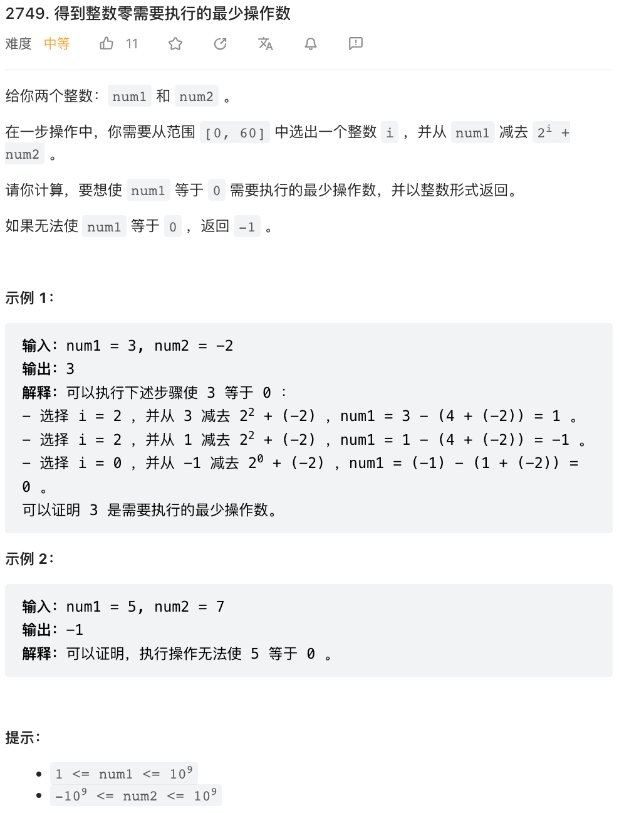

🐦 鸽子回来了！

本公众号停更两月期间，有两位朋友问我为啥不更了，我非常感动，原来我是有读者的，每篇文章个位数点击不是误点！

停更不完全是因为我跳槽了 😂 而是因为，我觉得流于形式没有太大的意思。更新公众号需要耗时一个小时左右，用这一个小时时间多做两道题对自己帮助更大。而且推己及人，我自己虽然有兴趣做题，但没有兴趣看题解，我也不清楚题解对别人有没有帮助。

重启之后，我做了一点调整，每周周赛四题退化为每周一题，我会从每周周赛中选择一道比较有意思的题目讲解（不一定是最后一题），内容更精炼，希望在几乎没有负担的前提下，每周提供一点点脑力锻炼。

本周周赛最有意思的题目感觉并不是第四题，而是第二题。



本题乍看上去就没啥头绪。仔细考虑一下，若 `k` 步操作之后 `num1` 等于 0，则有（公众号排版数学公式不方便，大家凑合着看），

`num1 = 2^(i1) + 2^(i2) ... + 2^(ik) + k * num2`

`num1 - k * num2 = 2^(i1) + 2^(i2) ... + 2^(ik)`

考虑第二个等式，则问题可以转换为，对于正整数 `num1 - k * num2` 能否用恰好 `k` 个 2 的幂次之和（或者称为二进制数位）表示？注意，这 `k` 个二进制数位是可以重复选取的。

我们考虑，对于任意一个整数 `x` 拆分成二进制数位之和，可能的拆分方法的加数个数取值范围。显然，加数最少的拆分方法就是 `x` 的二进制表示中 `1` 的个数，对应的拆分方法就是 `x` 的二进制表示的各个二进制数位（记为 `popcount(x)`. 再想一下，加数最多的拆分方法就是全部拆成 1，加数个数等于 `x` 的数值。

这道题作为第二题没有那么难，其实想到这里就可以「大胆猜想」给出题解了。但我们严密一点，补充一些证明。

一个点在于，其他拆分方法的加数个数取值范围，是不是在 `[popcount(x), x]` 范围内都是可行的。我们考虑最简单的情况，`x` 二进制表示只有一个 1 比如 `8 = 0b1000`，可以拆分成 `0b1000 = 0b0100 + 0b0100` 两个加数之和，对于 `0b0100` 可以递推的拆成两数之和。于是可以递推的证明（也可以用数学归纳法），对于 `[popcount(x), x]` 范围内拆分方法都确实存在。

如此，我们可以直接给出该题目的穷举法题解，从小到大尝试 $k$ 的取值，

```py
class Solution:
    def makeTheIntegerZero(self, num1: int, num2: int) -> int:
        k = 0
        while num1 > num2 * k or num2 < 0:
            k += 1
            x = num1 - num2 * k
            if bin(x).count('1') <= k and k <= x:
                return k
        return -1
```

在比赛中，这样就可以了，试着提交一下，过了就够了。但严格来说，还得证明一下这个穷举不会超时，也即 `k` 是个比较小的数字。

`num2 >= 0` 时，总是有 `popcount(x) < 64` 所以 64 步之内就可以解决问题。

`num2 < 0` 时，`x = - num2 * k + num1 > k` 恒成立，当 `k > 64` 时 `popcount(x) < k` 也恒成立，所以 64 步之内也总可以解决问题。

综上，这个枚举法不会超时。

下面是 C++ 版本。咱们可以偷个懒，C++ 20 标准中有一个 `popcount` 函数，可以计数一个整数的二进制表示中 1 的个数，更低版本的 C++ 中，GCC 和 Clang 编译器都提供了 `__builtin_popcount` 函数以及 lang lang 版本 `__builtin_popcountll`.

```cpp
class Solution {
public:
    int makeTheIntegerZero(int num1, int num2) {
        for(long long i = 1; num1 >= num2 * i or num2 < 0; i++) {
            long long x = num1 - num2 * i;
            if(__builtin_popcountll(x) <= i and x >= i) {
                return i;
            }
        }
        return -1;
    }
};
```
