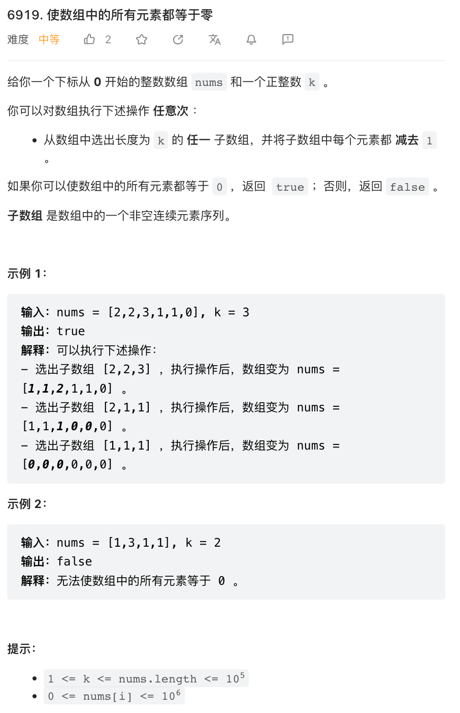

本周四道题目都比较简单，第三题第四题难度相似，我们一起来看一下第四题。



可以认为，我们需要对每个子数组（共有 `n-k+1` 个子数组）确定一个数 `x`（也即这个子数组的操作次数），数组内每个数都要减去 `x`。最终目标是所有元素变成 `0`。

这个问题非常眼熟，很容易发现，只有一个子数组能覆盖第一个数，所以这个子数组需要减去的数是确定的。一旦第一个数组的减数确定，第二个数组的减数也能被第二个数和第一个数组的减数确定，以此类推，可以贪心的从左向右（也可以从右向左）逐个确定每个子数组的减数。在这个过程中，任意一个数字变成负数就意味着无法完成。

但是，确定了一个子数组的减数之后，如果模拟的逐个从子数组的数中减去这个数，最终复杂度是 `n^2` 不可接受。比较容易想到的一个解决办法是，我们把会覆盖下一个数的所有减数放在一个双端队列中，并维护这个队列中数字和，这样只需要遍历一次输入 `O(n)` 的复杂度就能解决问题。

```py
class Solution:
    def checkArray(self, nums: List[int], k: int) -> bool:
        n = len(nums)
        q = collections.deque()
        total = 0
        
        for i in range(n):
            if i >= k:
                # 从第 `k` 个数开始，已经离开了最左侧的一个区间
                # 所以把最左侧的减数 pop 掉
                total -= q.popleft()
            if nums[i] < total or i > n - k and nums[i] != total:
                # 第一种情况：当前数字会变成负数，则再也无法变成 0 了
                # 第二种情况：如果当前已经是最后 k - 1 个数字，则无法向右打开新的子数组
                # 所以此时只要不是恰好变为 0 就会失败
                return False
            if i <= n - k:
                # 如果不是最后 k - 1 个数字，则以该数字为最左侧端点，打开一个子数组
                # 该子数组对应的减数必须恰好令 nums[i] 变为 0
                # 注意 nums[i] 首先需要减去已经打开的子数组减数之和
                q.append(nums[i] - total)
                total = nums[i]
        
        return True
```