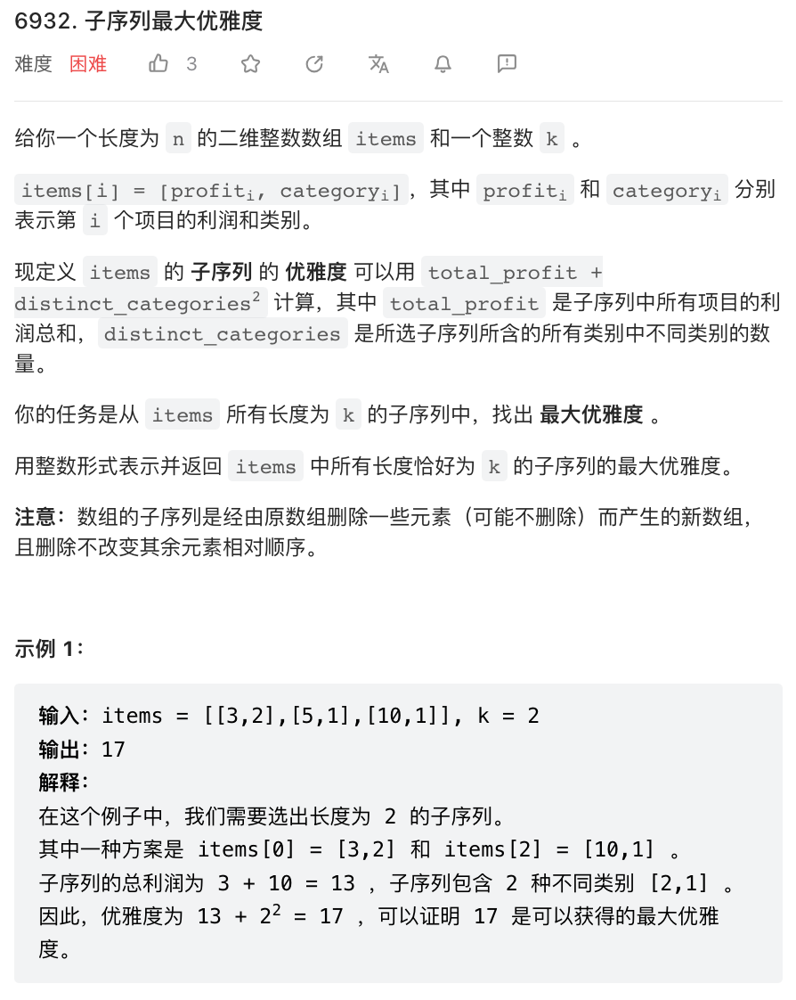
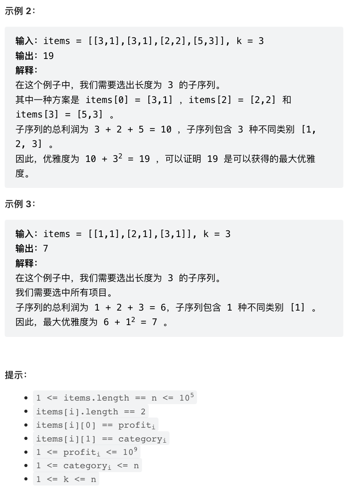

LeetCode 的难度最近水涨船高，已经快要超出我的舒适区了。本周周赛第四题非常像是推荐系统中关于效率和多样性的平衡，既要保证效率，又要推出尽可能多样化的结果。




本题难倒了周赛 99% 的参赛者。本题有点像背包问题，又有点像是动态规划，但实际上是个非常精妙的贪心。难点就在于贪心条件的证明。

解题思路上，本题数据规模很大，通常必须给出 $O(N)$ 或者 $O(N^2)$ 的解法，这就极大限制了动态规划算法，高度怀疑是贪心算法。如何对题目进行分治。**某个 $k$ 值下的最优解，跟 $k-1$ 时的最优解可能完全无关，因此难以关于 $k$ 进行分治。同样的，加入一个新的 item 可能会导致最优解完全不同，因此难以关于 item 进行分治**。

这个时候唯一剩下的一个角度是考虑 category. 我们先将所有 item 关于 category 分类，然后，**对于每一个 category, 当然是优先选择 profit 更高的 item.** 同时，为了最大化目标函数 `total profit + distinct categories ^ 2` 比较容易想到的一个思路是枚举 category 数量，然后求这种情况下的最大总分。

我们考虑将所有的 category 关于其最高 profit item 的 profit 降序排序，比如，如果输入数据是 `[[3,1],[4,1],[2,1],[5,2],[3,2]]`, 那我们先分类，再排序，得到 `[[5,3],[4,3,2]]`. 本题的关键特性是，**当最优方案是选取 $n$ 个 category 时，一定会选取上述排序条件下前 $n$ 个**。这是因为，如果最优方案没有选择某个 category $i$ 而是选择了排序靠后的 category $j$, 则只要将选中 $j$ 中任意一个 item 换成 $i$ 第一个 item，category 数量会增加，profit 也会增加，所以一定会得到总分更高的方案。

既然一定要选择前 $n$ 个 item, 那么最优方案只要选择每个 category 第一个 item 就能保证总分公式中第二项得分。余下的名额只需要在前 $n$ 个 catetory 中选择 $k - n$ 个 profit 最高的 item 即可。

```cpp
class Solution {
public:
    long long findMaximumElegance(vector<vector<int>>& items, int k) {
        int n = items.size();
        // 统计每个 category 最大 profit
        vector<int> catMax(n + 1);
        for(auto& p: items) {
            catMax[p[1]] = max(catMax[p[1]], p[0]);
        }

        // 将所有 item 先关于 category max profit 排序
        // 再关于 category 排序，再关于 profilt 排序
        // 这样能保证同一个 category 的 item 互相靠近
        sort(items.begin(), items.end(), [&](vector<int>& x, vector<int>& y) {
            return tie(catMax[x[1]], x[1], x[0]) > tie(catMax[y[1]], y[1], y[0]);
        });
        // 更直观的做法是将每个 category 放到一个 vector
        // 然后对二维数组排序，但当 category 特别多时
        // 这种做法会创建大量 vector 可能会超时

        // 优先队列维护已经被加到答案中的前 n 个 category 中
        // 除第一个 item 外 profit 最大的 item
        // 第一个 item 必须被选去所以不需要加入优先队列
        priority_queue<int, vector<int>, greater<int>> pq;
        // 按顺序，分别是
        // 优先队列中 item 的和
        // 每个 category 第一个 item 的和
        // category 个数
        // 出现过的最优解
        long long pqSum = 0, headSum = 0, cate = 1, res = 0;
        
        for(int i = 0, j = 0; i < n and cate <= k; i = j, cate++) {
            while(j < n and items[j][1] == items[i][1]) j++;
            // 以上特殊循环头将 i, j 指向了当前 category
            // 第一个 item 和最后一个 item 的后一位

            headSum += items[i][0];
            for(int k = i + 1; k < j; k++) {
                pq.push(items[k][0]);
                pqSum += items[k][0];
            }
            while(pq.size() > k - cate) {
                pqSum -= pq.top();
                pq.pop();
            }
            res = max(res, cate * cate + headSum + pqSum);
        }
        return res;
    }
};
```