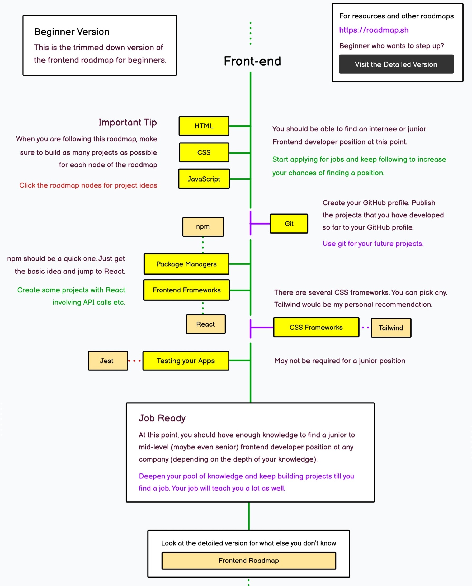
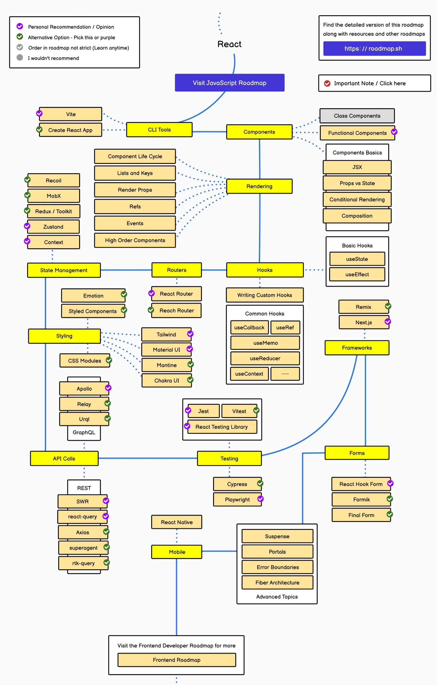

最近在试图学习前端技术。前端技术非常繁琐，几个月过，能忘得一干二净，甚至连学过什么也会忘的一干二净。在这里记录一下学习路线。

这是一篇「笔记的笔记」，记录知识体系，以及每块知识应该去哪里复习。除了本笔记列出的部分之外，前端学习另一个重要的记录方式是多做一些项目，并把项目代码妥善保管，作为以后的模板。

另外，ChatGPT 等 AI 工具对于前端学习和开发非常有帮助。

## 基础知识

首先，前端线路图可以参考该网站，

[roadmap.sh](https://roadmap.sh/frontend?r=frontend-beginner)

前端部分，

首先需要学习的当然是前端三件套，HTML, CSS, JavaScript, 这三部分需要按顺序学习。对于有其他领域编程经验的同学来说，JavaScript 不难掌握，反而是 HTML & CSS 知识比较琐碎，需要一些练习。

我的 HTML, CSS 部分是在 Youtube 看视频学习的，看视频有个问题是不方便复习、查阅。

【只能学习，难以复习查阅！】[Youtube Dave Gray](https://www.youtube.com/@DaveGrayTeachesCode)

所以从 JavaScript 部分开始，我主要在 MDN 学习，

【可以作为复习查阅的笔记！】[MDN Guides](https://developer.mozilla.org/en-US/docs/Learn)

学完 HTML/CSS/JS 之后，就可以不用框架写一些简单的网页了。

学习 HTML & CSS 时的样例 Repo,

[HTML Course](https://github.com/plus2047/html_course)

[CSS Course](https://github.com/plus2047/css_course)

## 通用工具

这里的「通用工具」指版本控制 Git, 包管理工具 npm, 以及开发工具 VSCode. 这三者是下一阶段学习的框架的基础。

对于有其他经验的程序员而言，Git 和 VSCode 当然不需要学习，并且在前面的教程中也会介绍。

这里特别指出，学习 npm 是为了学习框架做准备，单独学习这个工具是没什么用处的。打包工具 webpack 等单独学习也没什么用处。应该按照第一段给出的线路图，先简单学习 npm, 然后立即开始学习当前最流行的框架 React. 

**如果暂时先不学习框架，仅靠基础知识写一些简单的网页也是可以的，则此时包括 npm 在内的所有工具都不需要学习。**

于是，学习完第一部分 HTML/CSS/JS 并具备 Web 相关的基础知识之后，足以开始一些简单的开发。可以停留在这一阶段一点时间，练习、巩固。

## 前端框架

不幸的是，React 框架需要学习的东西也有很多，这一部分尚未开始学习，留待以后补充。

