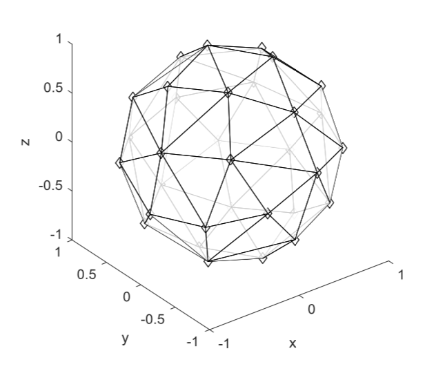

> Welcome to my blog !

Blog Template: [TMaize Blog](https://github.com/TMaize/tmaize-blog)

Blog Source: [github](https://github.com/plus2047/plus2047.github.io)

## Contact Me

- Email&: xjh_cn@yeah.net

- GitHub: [https://github.com/plus2047](https://github.com/plus2047)

## 成果

- AVSM4260 提案：一种基于 Ambisonics 全景录音球的麦克风阵列摆放实现方案

## 获奖

- 2018.10 TP-LINK 奖学金，三好学生
- 2017.07 北大信科学院优秀毕业论文，电子系优秀毕业生
- 2014.12 北京大学五四奖学金
- 2012.12 全国高中生物理竞赛省级赛区一等奖，决赛二等奖